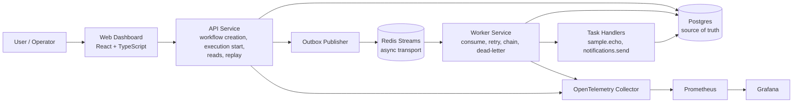
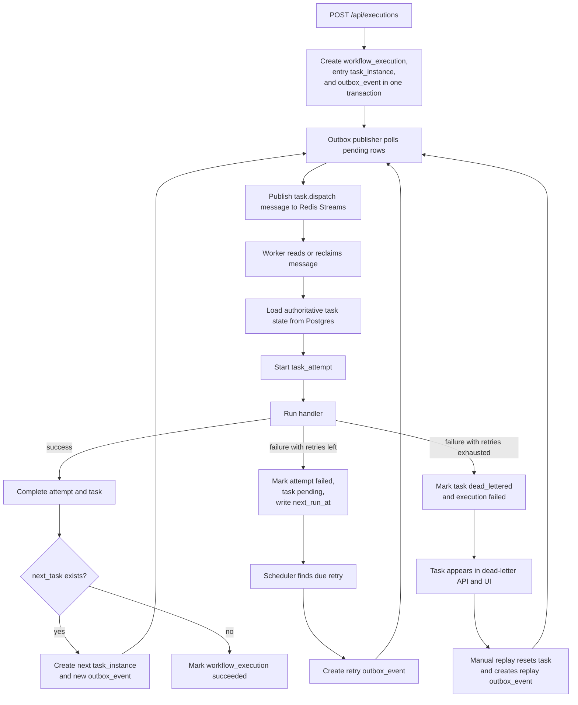
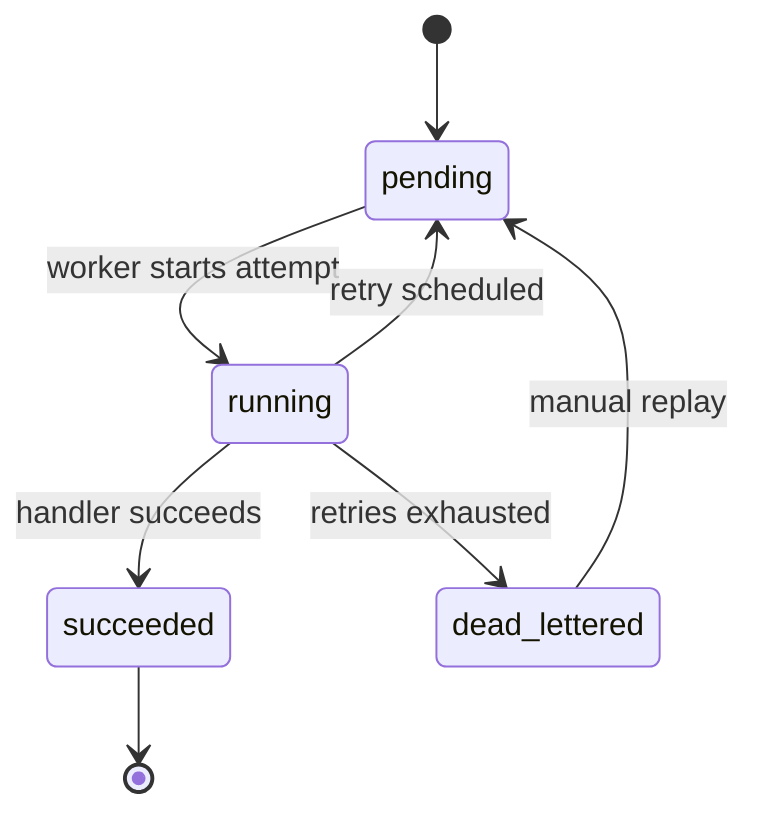

# DurableFlow Architecture

This document explains how DurableFlow works today, why the components are split the way they are, and which tradeoffs were made deliberately.

The system is intentionally small enough to understand in one sitting, but the problems it tackles are real:

- durable workflow state
- asynchronous task dispatch
- retries with persisted scheduling
- duplicate delivery under at-least-once semantics
- dead-letter handling and replay
- crash recovery for abandoned queue deliveries
- handler-level idempotency

## System goal

DurableFlow aims to be a workflow engine where:

- workflow truth survives crashes
- async delivery can be retried without corrupting state
- operators can explain what happened from durable records
- handlers can survive duplicate delivery without duplicating side effects

That goal is more important than raw feature count. The architecture favors correctness seams over feature breadth.

## Core invariants

There are four invariants that shape almost every design decision.

### 1. Postgres is the system of record

Workflow definitions, executions, task instances, attempts, retry state, dead-letter state, outbox events, and idempotency reservations all live in Postgres.

If Redis and Postgres disagree, Postgres wins.

### 2. Redis Streams is a delivery mechanism

Redis is used for asynchronous transport and consumer groups. It is not trusted to be the canonical source of workflow state.

That means the worker never treats a queue message alone as permission to run work. It always checks authoritative task state in Postgres first.

### 3. Delivery is at-least-once

The architecture assumes duplicate delivery can happen because:

- the publisher can crash after publishing but before durable acknowledgement
- the worker can crash after reading but before acking
- stale pending messages can later be reclaimed

So the system is designed to tolerate duplicates by default.

### 4. Idempotency is explicit

Handlers that model side effects must persist an idempotency boundary. DurableFlow uses `idempotency_records` for this so correctness is visible in storage instead of buried in handler conventions.

## High-level design

The high-level design is intentionally simple: one durable database, one async transport, one API boundary, one worker boundary, and one lightweight operator UI.

Key takeaways from this diagram:

- all durable state transitions end in Postgres
- Redis only moves execution opportunities between services
- the outbox sits between durable writes and queue publish
- the worker is free to receive duplicate deliveries because correctness lives in Postgres and idempotent handlers

## Component responsibilities

### API service

`apps/api`

The API service is responsible for:

- validating and storing workflow definitions
- creating workflow executions
- creating the initial task instance
- writing outbox dispatch intent transactionally
- exposing read APIs for executions and dead-lettered tasks
- running the outbox publisher loop

The API service does not execute task business logic. It creates durable orchestration state and hands off dispatch.

### Worker service

`apps/worker`

The worker service is responsible for:

- consuming Redis Streams messages through a consumer group
- reclaiming stale pending messages when needed
- loading authoritative task state from Postgres
- starting task attempts
- executing handlers
- applying success, retry, dead-letter, or workflow-progression logic

The worker is where most correctness-sensitive branching lives.

### Web dashboard

`apps/web`

The dashboard exists to make the system inspectable. It can:

- create definitions
- trigger executions
- poll execution snapshots
- display task attempts and retry state
- list dead-lettered tasks
- replay dead-lettered tasks

It is intentionally a lightweight operator-facing shell, not a full product UI.

The dashboard is built around four concrete operator states:

- an overview state for workflow creation and execution triggering
- a success state that shows task chaining and attempt history
- a dead-letter state that exposes terminal failures without raw database access
- a replay state that shows recovery re-entering the same durable execution path

Reference screenshots:

- [Overview](/Users/sumanth/Desktop/CodexApps/DurableWorkFlow/docs/screenshots/01-overview.jpeg)
- [Successful execution](/Users/sumanth/Desktop/CodexApps/DurableWorkFlow/docs/screenshots/02-successful-execution.jpeg)
- [Dead-letter handling](/Users/sumanth/Desktop/CodexApps/DurableWorkFlow/docs/screenshots/03-dead-letter-panel.jpeg)
- [Replay flow](/Users/sumanth/Desktop/CodexApps/DurableWorkFlow/docs/screenshots/04-replay-response.jpeg)

### Outbox publisher

`internal/outbox`

The outbox publisher is the bridge between durable database state and asynchronous Redis dispatch. It polls pending `outbox_events`, publishes task messages, and marks those outbox rows dispatched.

The important architectural point is that the same outbox mechanism is reused for:

- first-run task dispatch
- retry redispatch
- dead-letter replay
- next-task progression

That keeps the write path consistent.

### Redis queue adapter

`internal/queue`

This package isolates Redis Streams details:

- stream publishing
- consumer-group creation
- message decoding
- fresh reads
- stale pending reclaim with `XAUTOCLAIM`

This keeps Redis-specific operational logic out of orchestration code.

### Orchestrator layer

`internal/orchestrator`

This layer is where workflow semantics live:

- definition parsing and validation
- execution start logic
- worker-side retry decisions
- `next_task` progression
- terminal failure and dead-letter decisions

It exists so transport and persistence code do not absorb workflow rules.

## Data model and why each table exists

DurableFlow uses a deliberately explicit data model. The tables are not there for ceremony; each one solves a specific failure or observability problem.

### `workflow_definitions`

Stores the durable definition of a workflow.

Why it matters:

- executions can refer back to a stable definition
- validation has a durable home
- workflow versioning can be added later without redesigning the entire system

### `workflow_executions`

Represents one run of a workflow.

Why it matters:

- it is the parent entity for all task instances
- it captures input, output, lifecycle timestamps, and final error state
- it stays `running` while the workflow advances through multiple tasks

### `task_instances`

Represents a concrete unit of work inside one execution.

Why it matters:

- task state must be tracked independently from execution state
- retries need a place for `next_run_at`
- replay and dead-letter handling need their own lifecycle state
- linear progression needs distinct task rows, not one mutable execution blob
- idempotent handler execution needs a task-level key boundary

This table carries some of the most important statuses in the system:

- `pending`
- `running`
- `succeeded`
- `failed`
- `dead_lettered`

### `task_attempts`

Represents each processing attempt for a task.

Why it matters:

- retries are observable instead of hidden
- failure history is preserved
- execution snapshots can show operational history, not only final state

### `outbox_events`

Represents dispatch intent that has been durably stored before Redis publish.

Why it matters:

- it solves the classic “state written but message not published” failure mode
- it decouples workflow state transitions from queue timing
- it provides one dispatch path for first runs, retries, replay, and progression

### `idempotency_records`

Represents durable reservations and stored successful responses for handlers that must survive duplicate delivery.

Why it matters:

- the same side effect should not run twice for the same logical idempotency key
- a successfully completed response can be reused on duplicate delivery
- the same task instance can safely resume its own in-progress reservation
- a different task instance cannot hijack that same side-effect boundary

## Low-level execution flow

This diagram shows the write path and recovery path together. It is the most important flow in the system because it combines the outbox, retries, dead-lettering, replay, and worker crash recovery.

The most important property here is that initial dispatch, retry dispatch, next-task dispatch, and replay dispatch all converge back into the same outbox path.

## Task lifecycle state machine

The task state machine is small on purpose. It is easier to reason about correctness when the task lifecycle is explicit and finite.

## Main workflow paths

### Path 1: execution creation

When a client triggers an execution:

1. the API loads and validates the referenced workflow definition
2. it creates a `workflow_executions` row
3. it creates the entry `task_instances` row
4. it creates an `outbox_events` row in the same transaction

This is the first important durability boundary. The system never relies on publishing to Redis before the database acknowledges intent.

### Path 2: dispatch through the outbox

The outbox publisher:

1. polls pending outbox rows
2. publishes task messages to Redis Streams
3. marks the outbox rows dispatched in Postgres

The publisher treats Redis publish as a downstream side effect of a Postgres fact, not the other way around.

### Path 3: worker success

When a worker processes a message successfully:

1. it loads the authoritative task row
2. it starts a `task_attempts` row
3. it runs the handler
4. it marks the attempt succeeded
5. it marks the task succeeded
6. if the task has a `next_task`, it creates the next task row plus a new outbox row
7. otherwise it marks the workflow execution succeeded

This is how DurableFlow moves from a single task engine to a linear workflow engine.

### Path 4: retryable failure

If the handler fails but retries remain:

1. the attempt is marked failed
2. the task goes back to `pending`
3. `next_run_at` is written with the future retry time
4. the execution remains `running`

Later, the scheduler materializes a new outbox row once `next_run_at` becomes due.

The important detail is that retries are persisted as state, not held in memory.

### Path 5: exhausted failure

If the handler fails and retries are exhausted:

1. the attempt is marked failed
2. the task is marked `dead_lettered`
3. the execution is marked `failed`
4. timestamps and error text are preserved

The failure remains durable and inspectable.

### Path 6: dead-letter replay

Replay does not bypass the normal dispatch system.

When a dead-lettered task is replayed:

1. the task is reset to a runnable state in Postgres
2. the parent execution is moved back to `running`
3. a new outbox row is created
4. the outbox publisher sends it through Redis like any other task

That consistency is important. Replay is recovery, not a special shortcut.

### Path 7: crash recovery

If a worker crashes after claiming a Redis Streams message, the delivery may remain pending in the consumer group. DurableFlow handles that by reclaiming stale pending messages with `XAUTOCLAIM` before reading fresh `>` messages.

Reclaimed messages still go through the same worker code path and still consult Postgres first. That design avoids a second “recovery-only” execution path with different semantics.

## Why the outbox pattern matters here

The outbox is one of the most important pieces of the system.

Without it, the API could:

1. write a workflow execution and task row
2. crash before publishing to Redis

At that point, the workflow would exist durably but the work would never be dispatched.

The outbox solves that by making dispatch intent a durable database fact. Publishing becomes retryable because the system can always go back to Postgres and find the undispatched work.

## Why retries are persisted instead of slept

A common beginner design is to fail in the worker and then sleep before retrying.

DurableFlow does not do that because sleeping in process creates fragile behavior:

- restart loses retry intent
- the worker holds resources doing nothing
- retry state becomes invisible

By writing `next_run_at`, the system turns retry timing into durable data. That makes retries inspectable and restart-safe.

## Why dead-lettering is a task state, not a separate queue

At this stage, dead-lettering is modeled in Postgres rather than as a separate Redis DLQ stream.

That choice was intentional:

- Postgres is already the authoritative source of task state
- dead-lettering is fundamentally an operational state transition
- list and replay operations become simpler when the state is queryable directly

This keeps failure handling close to the authoritative task state and makes listing and replay straightforward. A separate DLQ transport could be added later if operational needs justify it.

## Why idempotency needed its own table

Task-level status alone is not enough to prove side-effect safety.

For example, a handler might:

1. call an external system successfully
2. crash before finishing local persistence

Without a durable idempotency record, the next delivery cannot safely know whether the side effect already happened.

`idempotency_records` solves that by making the side-effect boundary explicit. A handler can:

- reserve the idempotency key
- complete it with a stored response
- release it if setup fails
- allow the same task instance to resume if recovery is needed

That is a major correctness improvement over “best effort” deduplication.

## Current scope and deliberate limitations

DurableFlow is intentionally strong on infrastructure correctness and intentionally narrow on workflow expressiveness.

What it supports today:

- definition-driven execution
- linear `next_task` chaining
- retries with backoff
- dead-letter and replay
- crash recovery
- handler-level idempotency

What it does not support yet:

- workflow versioning
- branching or parallel task graphs
- cancellation and timeout policies
- richer operator audit tooling
- broader integration-specific idempotency policies

Those are not oversights. They were deferred so the system could get the hard durability boundaries right first.

## A simple mental model of the system

DurableFlow uses Postgres to decide what should happen, Redis to deliver opportunities to do that work, and idempotent handlers to make duplicate opportunities safe.

Those three pieces form the core of the architecture.
