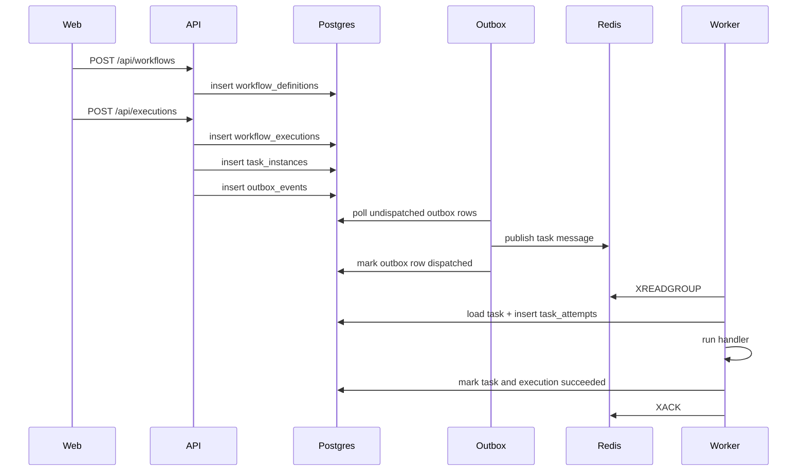

# DurableFlow Architecture

## Goal

Build a durable workflow engine where workflow state survives crashes, dispatch can be retried safely, and operational behavior is inspectable.

This first pass is intentionally small, but the structure is chosen so the later features can fit naturally.

## Core principles

- Postgres is the source of truth for workflow definitions, executions, task instances, attempts, and dispatch intent.
- Redis Streams is only a transport for task delivery.
- Delivery semantics are at-least-once.
- Task handlers must be idempotent.
- State transitions should be persisted before relying on in-memory assumptions.

## Components

### `apps/api`

Responsibilities:

- Expose HTTP endpoints for workflow definition creation and execution triggering
- Persist workflow state into Postgres
- Write outbox events as part of the same transaction as task creation
- Run the outbox publisher loop
- Expose `/healthz` and `/metrics`

### `apps/worker`

Responsibilities:

- Consume dispatched tasks from Redis Streams consumer groups
- Load authoritative task state from Postgres before executing work
- Create a task attempt record
- Execute a handler
- Persist success or failure back to Postgres
- Expose `/healthz` and `/metrics`

### `apps/web`

Responsibilities:

- Provide a minimal manual validation shell
- Create a workflow definition
- Trigger an execution
- Poll the current execution snapshot

This is deliberately not a full dashboard yet.

### `internal/db`

Responsibilities:

- Open the Postgres pool
- Apply SQL migrations
- Encapsulate data access for definitions, executions, tasks, attempts, and outbox events

### `internal/orchestrator`

Responsibilities:

- Keep workflow-related application logic out of transport and persistence glue
- Host the execution-start logic
- Host the worker-side processing flow

### `internal/outbox`

Responsibilities:

- Poll undispatched outbox rows
- Publish task dispatch messages to Redis Streams
- Mark dispatch completion in Postgres

### `internal/queue`

Responsibilities:

- Hide Redis Streams-specific concerns behind a small adapter
- Create the consumer group if needed
- Publish and consume task messages

### `internal/handlers`

Responsibilities:

- Register handler implementations by key
- Provide the sample task handler used by the initial happy path

### `internal/telemetry`

Responsibilities:

- Bootstrap OpenTelemetry traces
- Expose Prometheus metrics
- Add lightweight HTTP instrumentation

## Current data model

### `workflow_definitions`

Represents the stored definition of a workflow.

Why it exists:

- Lets executions point back to a stable definition
- Gives you a home for future versioning and validation logic

### `workflow_executions`

Represents one run of a workflow.

Why it exists:

- Holds lifecycle state
- Stores execution input and eventual output/error
- Becomes the parent of all task instances

### `task_instances`

Represents the concrete task units created for a workflow execution.

Why it exists:

- Tracks delivery and completion state separately from the workflow execution
- Holds handler routing metadata
- Gives you a place for scheduling fields like `next_run_at`
- Carries an `idempotency_key` for future hardening

### `task_attempts`

Represents each processing attempt for a task instance.

Why it exists:

- Preserves execution history
- Makes retries observable and auditable
- Provides a future seam for backoff and DLQ behavior

### `outbox_events`

Represents dispatch intent stored in Postgres before sending to Redis.

Why it exists:

- Keeps Postgres authoritative
- Decouples durable state changes from transient dispatch
- Provides the base for more reliable re-dispatch and recovery later

## Current request and processing flow

## Why the outbox matters here

Without an outbox, the API could write task state to Postgres and then crash before publishing to Redis, leaving work stranded. With an outbox row, the dispatch intent is durable even if the publish step happens later.

This starter does not implement a fully hardened outbox processor yet, but it already gives you the right persistence seam for that work.

## Why at-least-once changes the design

Redis Streams consumer groups can redeliver work, and a publisher can also re-publish if it crashes between external publish and durable acknowledgement.

That means:

- Duplicate task messages are normal, not exceptional
- Worker logic must read task state from Postgres before doing work
- Handlers should be safe to run more than once

The sample handler is intentionally simple, but the system shape assumes idempotency from the start.

## Known intentional gaps

These are not missing by accident. They are the next learning steps.

- Workflow definitions are not yet expanded into real task graphs
- Retry scheduling is not implemented
- Delayed tasks are not dispatched from `next_run_at`
- Pending consumer-group messages are not reclaimed after worker crashes
- DLQ behavior is not implemented
- Workflow versioning is not implemented
- Cancellation is not implemented
- Handler-level idempotency is only lightly modeled today

## Extension points

### Definition-driven graph expansion

Primary seam:

- [internal/orchestrator/service.go](/Users/sumanth/Desktop/CodexApps/DurableWorkFlow/internal/orchestrator/service.go)
- [internal/db/store.go](/Users/sumanth/Desktop/CodexApps/DurableWorkFlow/internal/db/store.go)

Current behavior:

- One hardcoded sample task is created per execution

Future direction:

- Parse the stored workflow definition
- Generate task instances from the graph
- Track dependencies and ready-to-run tasks

### Retries and backoff

Primary seam:

- [internal/db/store.go](/Users/sumanth/Desktop/CodexApps/DurableWorkFlow/internal/db/store.go:279)
- [internal/orchestrator/worker.go](/Users/sumanth/Desktop/CodexApps/DurableWorkFlow/internal/orchestrator/worker.go)

Future direction:

- Fail attempts without always failing the whole workflow immediately
- Compute next retry time
- Requeue only when retry policy allows it

### Delayed execution and scheduler

Primary seam:

- `task_instances.next_run_at`
- `outbox_events.available_at`

Future direction:

- Scheduler loop scans ready tasks in Postgres
- Scheduler writes outbox events when a delayed task becomes runnable

### Crash recovery

Primary seam:

- `task_attempts`
- Redis consumer-group pending entries
- `task_instances.status`

Future direction:

- Reconcile in-flight attempts after crashes
- Reclaim pending stream messages
- Decide whether the source of truth says the task should resume, retry, or stop

### Idempotency hardening

Primary seam:

- `task_instances.idempotency_key`
- handler boundary in [internal/handlers](/Users/sumanth/Desktop/CodexApps/DurableWorkFlow/internal/handlers)

Future direction:

- Persist deduplication markers per side effect
- Make external integrations safe under duplicate delivery

