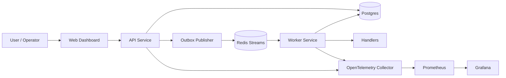
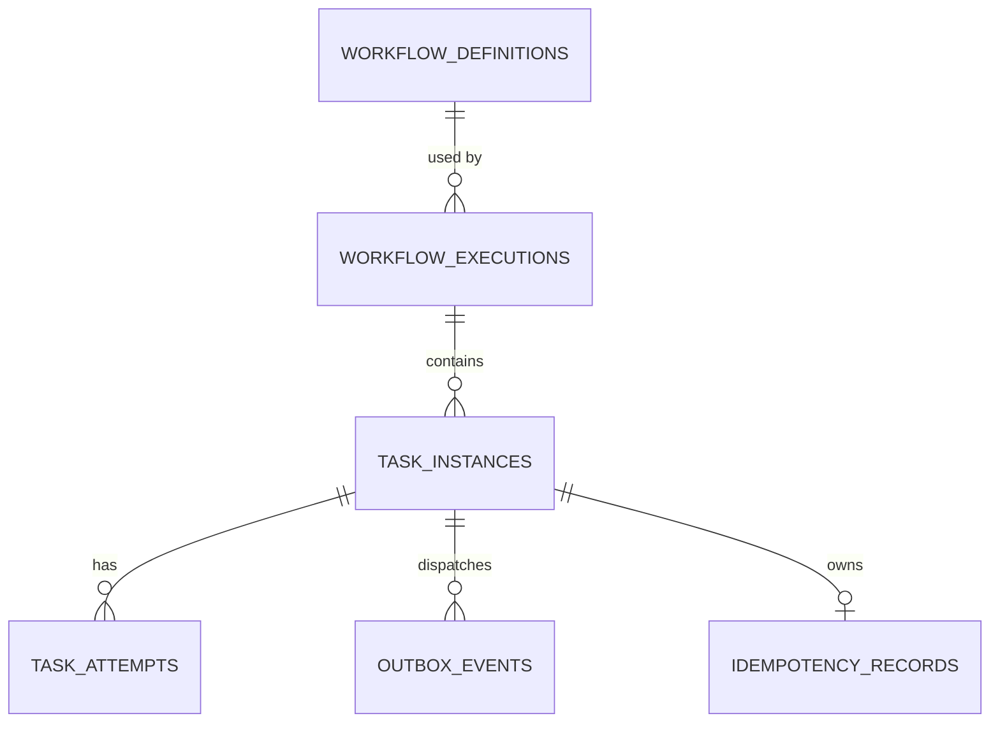
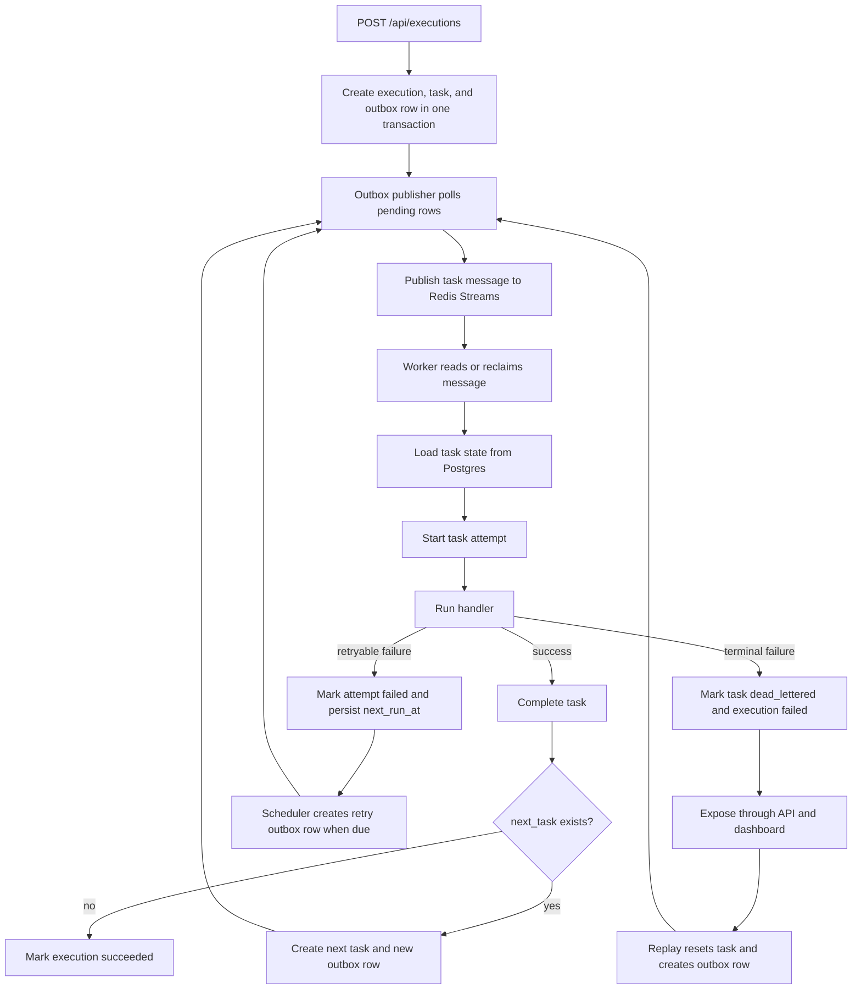
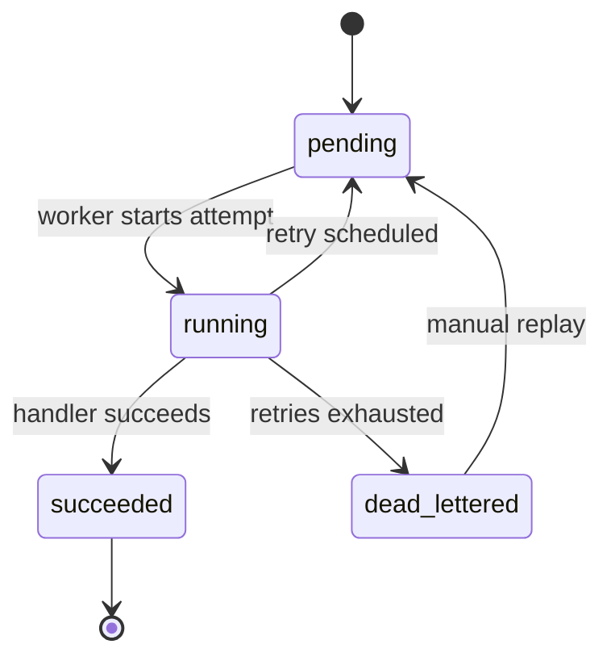

# DurableFlow Architecture

DurableFlow is a small workflow engine built around one idea: keep execution truth in Postgres, use Redis Streams only for delivery, and assume duplicate delivery can happen.

## Goal

The system is meant to handle the failure cases that usually make background work messy:

- state is written but work is not published
- a task is delivered more than once
- retries need to survive restarts
- a task fails permanently and needs replay
- a worker crashes after claiming a message

## Core invariants

### 1. Postgres is authoritative

Workflow definitions, executions, tasks, attempts, retries, dead-letter state, outbox rows, and idempotency records all live in Postgres.

If Redis and Postgres disagree, Postgres wins.

### 2. Redis Streams is transport

Redis carries delivery opportunities. It does not define workflow truth.

Workers always check Postgres before running task logic.

### 3. Delivery is at-least-once

Duplicate delivery is expected because:

- publish can succeed before durable acknowledgment
- a worker can crash before acking
- stale pending messages can be reclaimed later

### 4. Idempotency is explicit

Handlers that cross side-effect boundaries use `idempotency_records` so duplicate-safe behavior is visible in durable state.

## System view

## Main components

### API

`apps/api`

Responsible for:

- storing workflow definitions
- creating executions
- creating the first task
- writing outbox intent in the same transaction
- exposing execution, dead-letter, and replay APIs
- running the outbox publisher loop

### Worker

`apps/worker`

Responsible for:

- consuming Redis Streams messages
- reclaiming stale pending messages
- loading authoritative task state
- starting attempts
- running handlers
- deciding success, retry, dead-letter, or next-task progression

### Dashboard

`apps/web`

Keeps the system easy to inspect:

- create definitions
- trigger executions
- view execution snapshots
- inspect attempts and retry state
- list dead-lettered tasks
- replay dead-lettered tasks

Reference screenshots:

- [Overview](docs/screenshots/01-overview.jpeg)
- [Successful execution](docs/screenshots/02-successful-execution.jpeg)
- [Dead-letter handling](docs/screenshots/03-dead-letter-panel.jpeg)
- [Replay flow](docs/screenshots/04-replay-response.jpeg)

### Outbox

`internal/outbox`

Bridges Postgres state and Redis publish.

The same outbox path is used for:

- first-run dispatch
- retry redispatch
- replay
- next-task progression

### Queue adapter

`internal/queue`

Wraps Redis Streams details:

- publish
- consumer-group setup
- read and decode
- stale-message reclaim with `XAUTOCLAIM`

### Orchestrator

`internal/orchestrator`

Owns workflow semantics:

- definition validation
- execution creation
- retry behavior
- dead-letter decisions
- next-task chaining

## Data model

### Core tables

- `workflow_definitions`
- `workflow_executions`
- `task_instances`
- `task_attempts`
- `outbox_events`
- `idempotency_records`

### Why they exist

- `workflow_definitions`: stores durable workflow specs
- `workflow_executions`: one row per workflow run
- `task_instances`: one row per concrete task in an execution
- `task_attempts`: preserves retry history
- `outbox_events`: stores dispatch intent before Redis publish
- `idempotency_records`: protects side effects under duplicate delivery

## Entity relationship view

## Code map

- [internal/orchestrator/service.go](internal/orchestrator/service.go): execution creation
- [internal/orchestrator/worker.go](internal/orchestrator/worker.go): runtime task handling
- [internal/outbox/publisher.go](internal/outbox/publisher.go): outbox polling and publish
- [internal/queue/redis_streams.go](internal/queue/redis_streams.go): Redis Streams delivery and reclaim
- [internal/db/store.go](internal/db/store.go): workflow and task persistence
- [internal/db/idempotency.go](internal/db/idempotency.go): idempotency reservations and stored responses

## Main flow

## Important paths

### Execution start

When an execution is triggered, the API writes:

- one `workflow_executions` row
- one entry `task_instances` row
- one `outbox_events` row

All three happen in one transaction.

### Success path

On success, the worker:

- completes the attempt
- completes the task
- either creates the next task and outbox row
- or marks the workflow execution complete

### Retry path

Retries are persisted, not slept in memory.

The worker:

- marks the attempt failed
- moves the task back to `pending`
- writes `next_run_at`

Later, a scheduler turns due retries into new outbox rows.

### Dead-letter and replay

When retries are exhausted:

- the task becomes `dead_lettered`
- the execution becomes `failed`

Replay does not bypass the engine. It resets state in Postgres and re-enters through the normal outbox path.

### Crash recovery

If a worker dies after claiming a Redis message, the message may stay pending in the consumer group. DurableFlow reclaims stale messages with `XAUTOCLAIM`.

Reclaimed messages still go through the normal worker path and still consult Postgres first.

### Idempotency

Task state alone is not enough to protect side effects.

`idempotency_records` allows a handler to:

- reserve a durable idempotency key
- store a successful response
- let the same task instance resume safely
- block a different task instance from repeating the same side effect

## Task lifecycle

## Current scope

What the system supports today:

- definition-driven execution
- linear `next_task` chaining
- durable retries
- dead-letter listing and replay
- worker reclaim for stale pending messages
- handler-level idempotency

What it does not support yet:

- workflow versioning
- branching or parallel graphs
- cancellation and timeouts
- richer replay audit tooling

## Short mental model

Postgres decides what should happen, Redis delivers chances to do that work, and idempotent handlers make duplicate chances safe.
