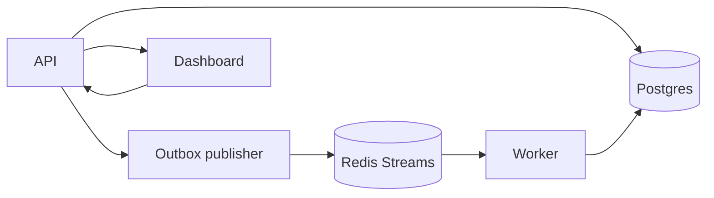

# DurableFlow

[](https://github.com/codetitan9999/DurableWorkFlowEngine/actions/workflows/ci.yml)

DurableFlow is a Go-based workflow engine for multi-step background jobs. It uses Postgres for durable execution state, Redis Streams for async delivery, and a small React dashboard for inspection and replay.

Quick links: [Architecture](ARCHITECTURE.md) · [Dashboard walkthrough](#dashboard-walkthrough) · [Postman setup](docs/postman/README.md) · [Benchmarks](docs/benchmarks.md) · [Operations](docs/operations.md) · [Changelog](CHANGELOG.md)

## Why this project exists

Background jobs look easy until failure shows up in the middle:

- state is written but work is not published
- a task is delivered more than once
- retries need to survive restarts
- a permanently failed task needs safe replay
- a worker crashes after claiming a message

DurableFlow is a small project built to handle those cases explicitly.

## What it supports

- transactional outbox-based dispatch
- durable retries with persisted `next_run_at`
- dead-letter handling and replay
- Redis consumer-group reclaim with `XAUTOCLAIM`
- handler-level idempotency for duplicate-safe side effects
- execution snapshots and a lightweight operations dashboard

## Core idea

- Postgres is the source of truth.
- Redis Streams is transport, not truth.
- Delivery is at-least-once, so the system must tolerate duplicates.

## Quick proof

- workflow state, attempts, retries, dead-letter state, and idempotency records are stored in Postgres
- every dispatch path goes through the outbox, including retries and replay
- reclaimed Redis messages are checked against Postgres before work is run again
- duplicate side effects are blocked through persisted idempotency reservations and stored responses

## System at a glance



## Start here

If you are skimming the repo, this is the fastest path:

1. Read [ARCHITECTURE.md](ARCHITECTURE.md).
2. Scan the [dashboard walkthrough](#dashboard-walkthrough).
3. Use the [Postman collection](docs/postman/README.md).
4. Open [docs/benchmarks.md](docs/benchmarks.md) and [docs/operations.md](docs/operations.md) if you want the measurement and observability details.

## Dashboard walkthrough

### 1. Overview

Create a workflow, trigger an execution, inspect the latest API response, and monitor dead-lettered tasks from one place.


### 2. Successful multi-step execution

Completed linear workflow with both task instances and final `succeeded` status visible in the execution snapshot.


### 3. Dead-letter handling

Terminal failure with attempt history, error details, and dead-letter visibility in the same UI.


### 4. Replay flow

Replay moves a dead-lettered task back through the normal durable dispatch path instead of using a special recovery shortcut.


## Tech highlights

- workflow definition storage and validation
- execution creation from stored definitions
- transactional task creation plus outbox dispatch intent
- asynchronous task dispatch through Redis Streams
- durable task attempts and execution snapshots
- retry scheduling with persisted `next_run_at`
- outbox-based redispatch for delayed retries
- linear multi-step workflow chaining through `next_task`
- dead-lettered task handling with list and replay support
- Redis consumer-group recovery for stale pending messages
- handler-level idempotency backed by persisted reservations and stored responses
- a containerized multi-service local stack with Docker Compose
- focused unit and integration tests around orchestration, outbox dispatch, retry scheduling, replay, idempotency conflicts, and Redis recovery logic

## Stack

### Services

- `api`: HTTP API plus outbox publisher
- `worker`: Redis Streams consumer and task executor
- `web`: React dashboard for workflow creation, inspection, dead-letter visibility, and replay

### Infrastructure in the local stack

- Postgres
- Redis
- OpenTelemetry collector
- Prometheus
- Grafana

For scaling benchmarks, the compose file also includes a `worker-bench` profile that starts extra consumers in the same Redis group without publishing additional host ports.

### Core tables

- `workflow_definitions`
- `workflow_executions`
- `task_instances`
- `task_attempts`
- `outbox_events`
- `idempotency_records`

## Repository map

```text
apps/
  api/       API entrypoint and outbox loop
  worker/    Worker entrypoint and task execution path
  web/       React operations dashboard
internal/
  config/       environment and runtime configuration
  db/           Postgres access, migrations, idempotency store
  domain/       shared domain models and statuses
  handlers/     sample handlers and idempotency-aware side effects
  httpapi/      HTTP routing and JSON handlers
  orchestrator/ workflow creation and worker orchestration logic
  outbox/       durable outbox polling and publish logic
  queue/        Redis Streams adapter and stale-message reclaim
  telemetry/    tracing and metrics bootstrap
migrations/     SQL schema evolution
deployments/    local observability config
```

## Where to look in code

- [ARCHITECTURE.md](ARCHITECTURE.md) for the design and invariants
- [migrations/001_init.sql](migrations/001_init.sql) for the data model
- [internal/orchestrator/service.go](internal/orchestrator/service.go) for execution creation
- [internal/outbox/publisher.go](internal/outbox/publisher.go) for dispatch
- [internal/orchestrator/worker.go](internal/orchestrator/worker.go) for retry, chaining, and failure handling
- [internal/queue/redis_streams.go](internal/queue/redis_streams.go) for Redis Streams delivery and reclaim
- [internal/db/idempotency.go](internal/db/idempotency.go) for idempotency ownership and stored responses

## Quick start

### Prerequisites

- Docker
- Docker Compose v2

Optional for running services outside Docker:

- Go 1.23+
- Node 22+ with npm

### Start the stack

```bash
cp .env.example .env
docker compose up --build
```

## Local endpoints

- Dashboard: [http://localhost:5173](http://localhost:5173)
- API health: [http://localhost:8080/healthz](http://localhost:8080/healthz)
- Worker health: [http://localhost:8081/healthz](http://localhost:8081/healthz)
- Prometheus: [http://localhost:9090](http://localhost:9090)
- Grafana: [http://localhost:3000](http://localhost:3000)

## Validate locally

- Run backend tests with `go test ./...`
- Build the web app with `npm --prefix apps/web run build`
- Use the [Postman collection](docs/postman/README.md) for API checks
- See [docs/benchmarks.md](docs/benchmarks.md) for load runs
- See [docs/operations.md](docs/operations.md) for observability and runbook checks

## Minimal API examples

Create a workflow:

```bash
curl -X POST http://localhost:8080/api/workflows \
  -H 'Content-Type: application/json' \
  -d '{
    "name": "demo-order-flow",
    "description": "Linear workflow demo",
    "definition": {
      "entry_task": "validate-order",
      "tasks": [
        {
          "name": "validate-order",
          "handler_key": "sample.echo",
          "next_task": "send-notification",
          "max_attempts": 3,
          "backoff_seconds": 10
        },
        {
          "name": "send-notification",
          "handler_key": "notifications.send"
        }
      ]
    }
  }'
```

Trigger an execution:

```bash
curl -X POST http://localhost:8080/api/executions \
  -H 'Content-Type: application/json' \
  -d '{
    "workflow_definition_id": "<workflow-definition-id>",
    "input": {
      "order_id": "demo-order-123",
      "customer_email": "demo@example.com"
    }
  }'
```

Inspect one execution:

```bash
curl http://localhost:8080/api/executions/<execution-id>
```

List dead-lettered tasks:

```bash
curl http://localhost:8080/api/dead-letter-tasks?limit=10
```

Replay one dead-lettered task:

```bash
curl -X POST http://localhost:8080/api/tasks/<task-id>/replay
```

## Known limits

- workflow chaining is linear, not a general DAG
- running-task recovery still depends on message redelivery plus Postgres state checks; there is no separate lease or heartbeat model for long-running tasks
- the outbox path works well in the current single-API local shape, but multi-publisher coordination has not been stress-tested
- workflow definitions are not versioned yet
- the dashboard is intentionally lightweight
- replay exists, but there is no richer operator audit trail yet
- benchmark numbers are local Docker-based measurements, not production claims

## Performance snapshot

- default `OUTBOX_POLL_INTERVAL=2s`: about `~5 exec/s` for a 2-step workflow
- tuned `OUTBOX_POLL_INTERVAL=100ms`: about `~99 exec/s` at `200` concurrent executions
- after interrupting `1` of `3` workers, the system still sustained about `~98 exec/s`
- losing the only worker causes a large latency spike, but work still recovers after reclaim

Full benchmark runs and methodology live in [docs/benchmarks.md](docs/benchmarks.md).

## What to read next

- [ARCHITECTURE.md](ARCHITECTURE.md) for a deeper explanation of the system design
- [docs/benchmarks.md](docs/benchmarks.md) for the full benchmark results and methodology
- [docs/operations.md](docs/operations.md) for observability, alerts, and operating checks
- [TASKS.md](TASKS.md) for the implementation history and remaining roadmap
