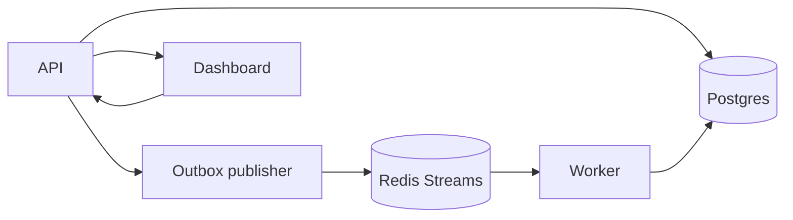

# DurableFlow

DurableFlow is a workflow orchestration project built to explore the parts of distributed systems that usually become painful only after failures show up: durable state, retries, duplicate delivery, dead-letter handling, crash recovery, and idempotency.

The project is centered on one rule:

- Postgres is the source of truth.
- Redis Streams is transport, not truth.
- Delivery is at-least-once, so the system must tolerate duplicates.

That rule drives most of the important tradeoffs in the codebase.

## Quick proof

What this project currently proves:

- transactional outbox keeps dispatch intent in durable state instead of relying on in-memory publish timing
- retry state is persisted in Postgres through `next_run_at` and materialized later through the outbox
- dead-letter replay reuses the same durable dispatch path as first-run execution
- Redis consumer-group reclaim handles abandoned messages through `XAUTOCLAIM`
- handler-level idempotency prevents duplicate side effects under at-least-once delivery

## System at a glance



## What the project does today

DurableFlow currently supports:

- workflow definition storage and validation
- execution creation from stored definitions
- transactional task creation plus outbox dispatch intent
- asynchronous task dispatch through Redis Streams
- durable task attempts and execution snapshots
- retry scheduling with persisted `next_run_at`
- outbox-based redispatch for delayed retries
- linear multi-step workflow chaining through `next_task`
- dead-lettered task handling with list and replay support
- Redis consumer-group recovery for stale pending messages
- handler-level idempotency backed by persisted reservations and stored responses
- a containerized multi-service local stack with Docker Compose
- focused unit and integration tests around orchestration, outbox dispatch, retry scheduling, replay, idempotency conflicts, and Redis recovery logic

In practical terms, a workflow can be created, triggered, dispatched asynchronously, retried safely, recovered after failure, replayed after dead-lettering, and inspected end to end.

## Why this project is technically interesting

Many workflow systems look simple until something goes wrong. The hard problems start when:

- a process crashes after writing state but before publishing work
- a worker receives the same message twice
- a task fails and needs delayed retry instead of immediate failure
- a human needs to inspect permanently failed work and replay it safely
- a recovered worker picks up a message that was abandoned by another worker
- a handler touches an external side effect and must not repeat it accidentally

DurableFlow tries to handle those problems directly instead of leaving them as future cleanup work.

The project demonstrates:

- transactional outbox design
- durable workflow and task state modeling
- at-least-once delivery semantics
- retry scheduling from persisted timestamps instead of in-memory sleeps
- Postgres-backed dead-letter workflows
- manual replay through the same dispatch pipeline
- stale-message reclaim with Redis consumer groups
- task-owned idempotency reservations for side-effect safety

## The most important design decisions

### 1. Postgres is authoritative

Workflow definitions, executions, task instances, attempts, retry state, dead-letter state, outbox rows, and idempotency records all live in Postgres.

That means:

- the system can survive process restarts without losing workflow truth
- async delivery can be retried independently of business state
- operators can inspect what happened from the database, not only from logs

### 2. Redis Streams is used only for delivery

Redis is used here for asynchronous transport and consumer groups, but it is not treated as the source of workflow truth.

If Redis says a message exists but Postgres says the task is already complete, Postgres wins.

### 3. Every dispatch path flows through the outbox

The outbox is not only for first-run task dispatch. It is also used for:

- retry redispatch
- dead-letter replay
- next-task progression in a workflow chain

That keeps the write path consistent and reduces the number of separate delivery paths to reason about.

### 4. Idempotency is explicit, not implied

The built-in handlers reserve durable idempotency keys in Postgres, store successful responses, and allow the same task instance to resume work safely after retries or crash recovery.

## End-to-end flow

At a high level, one execution looks like this:

1. A workflow definition is created through the API.
2. An execution is triggered against that stored definition.
3. The API writes:
   - a `workflow_executions` row
   - an initial `task_instances` row
   - an `outbox_events` row
4. The outbox publisher reads the undispatched outbox row and publishes a Redis Streams message.
5. The worker consumes the message, loads authoritative task state from Postgres, and records a `task_attempts` row.
6. The handler runs.
7. On success:
   - the current task attempt is completed
   - the current task is completed
   - the next task is enqueued if `next_task` exists
   - otherwise the workflow execution is completed
8. On failure:
   - the task is either scheduled for retry with `next_run_at`
   - or marked `dead_lettered` if retries are exhausted
9. A dead-lettered task can later be replayed manually, which pushes it back into the same outbox-driven dispatch path.

## Failure and recovery paths

This is where most of the failure-handling behavior lives.

### Retry scheduling

Retries are not implemented as “sleep and try again.” A failed task is moved back to `pending`, its next eligible execution time is written into `task_instances.next_run_at`, and a scheduler loop materializes a new outbox event once that time arrives.

This keeps retry timing in durable state instead of process memory.

### Dead-letter and replay

If retries are exhausted, the task is marked `dead_lettered` and the workflow execution is marked `failed`. Dead-lettered tasks are queryable through the API and visible in the dashboard. Replay resets the task to a runnable state and pushes it back through the outbox so recovery uses the same durable machinery as initial execution.

### Crash recovery

If a worker crashes after claiming a Redis Streams message, that message can remain pending in the consumer group. DurableFlow uses Redis `XAUTOCLAIM` to reclaim stale pending deliveries and route them back through the worker path. The worker still consults Postgres before doing work, so reclaimed deliveries do not blindly repeat already-finished tasks.

### Idempotency

The built-in handlers use `idempotency_records` to reserve and complete side-effect boundaries. If the same handler is invoked again with the same logical idempotency key:

- a completed response can be reused
- the same task instance can resume its own in-progress reservation
- a different duplicate task instance is blocked from repeating the side effect

This is one of the main correctness boundaries in the project.

## Current system shape

### Services

- `api`: HTTP API plus outbox publisher
- `worker`: Redis Streams consumer and task executor
- `web`: React dashboard for workflow creation, inspection, dead-letter visibility, and replay

### Infrastructure in the local stack

- Postgres
- Redis
- OpenTelemetry collector
- Prometheus
- Grafana

The stack is meant to run as one reproducible local system, not as disconnected code samples. Docker Compose brings up the API, worker, web dashboard, Postgres, Redis, and observability services together so retry behavior, replay, crash recovery, and inspection can be exercised end to end.

For scaling benchmarks, the compose file also includes a `worker-bench` profile that starts extra consumers in the same Redis group without publishing additional host ports.

### Core persistence model

- `workflow_definitions`
- `workflow_executions`
- `task_instances`
- `task_attempts`
- `outbox_events`
- `idempotency_records`

## Performance and Boundaries

The project includes local benchmark runs against the real API, outbox publisher, Redis Streams path, and worker execution path. The goal of these runs is to show how the current implementation behaves under load and where the first bottlenecks appear.

### Default runtime shape

With the default `OUTBOX_POLL_INTERVAL=2s`, the `2-step` happy-path workflow plateaued at roughly `~5 exec/s`:

- `120` executions, concurrency `30`: `4.99 exec/s`, reported latency avg `5.79s`, p95 `5.98s`
- `240` executions, concurrency `60`: `4.99 exec/s`, reported latency avg `11.47s`, p95 `11.99s`

This lines up with the current design:

- outbox publisher drains up to `20` rows per poll
- default poll interval is `2s`
- a `2-step` workflow needs `2` dispatches per execution
- theoretical ceiling is therefore about `~5 exec/s`

### Tuned runtime shape

To check whether that ceiling came from the overall design or from a specific runtime setting, the API was rerun with `OUTBOX_POLL_INTERVAL=100ms` and no code changes. Under that tuned setting, the same `2-step` workflow sustained roughly `~99 exec/s`:

- `240` executions, concurrency `60`: `97.30 exec/s`, avg `462ms`, p95 `524ms`
- `1000` executions, concurrency `200`: `98.92 exec/s`, avg `1.80s`, p95 `1.97s`
- `5000` executions, concurrency `500`, `1s` polling: `99.28 exec/s`, avg `4.43s`, p95 `4.92s`
- `10000` executions, concurrency `1000`, `1s` polling: `99.45 exec/s`, avg `9.26s`, p95 `9.86s`

This suggests that the first boundary in the default setup was mainly publisher cadence, not worker count.

### Failure-path behavior

The benchmark suite also measured the failure and recovery paths:

- persisted retries, `3` attempts, `1s` backoff: `0.53 exec/s` by default and `1.25 exec/s` under the tuned outbox cadence, with exactly `3` attempts per execution
- immediate dead-letter on missing handler: `1.38 exec/s`, avg `1.58s`, p95 `1.83s`
- replay of a dead-lettered task through the normal dispatch path: avg `3.77s`, p95 `3.93s`, with exactly `2` attempts per execution

### Crash recovery

One run intentionally stopped the only worker mid-flight, waited through the reclaim window, then restarted it:

- all `20/20` executions still succeeded
- throughput dropped to `0.29 exec/s`
- reported latency avg rose to `16.77s`
- reported latency p95 rose to `55.82s`
- attempts per execution still stayed at `2`

This shows that consumer failure can delay work significantly while the system still recovers without losing work.

### Soak and mixed workload checks

The default `100 exec / 20 concurrency` happy-path shape was also repeated `30` times as a soak run:

- throughput avg stayed at `5.01 exec/s`
- reported latency p95 avg stayed at `3.95s`
- first-5 vs last-5 run averages stayed nearly flat

A mixed workload run combined success, retry, dead-letter, and replay traffic in parallel:

- happy-path throughput dropped to `3.64 exec/s`
- happy-path reported p95 stayed near the normal range at `3.90s`

That suggests mixed failure traffic reduced the share of throughput available to the happy path before it caused a major latency spike.

### Multi-worker benchmarks

The repo now includes a scale-only `worker-bench` profile for multi-worker runs. With the API kept in the tuned `OUTBOX_POLL_INTERVAL=100ms` shape:

- `1000` executions at concurrency `200` with `1` worker averaged `98.95 exec/s`
- the same workload with `3` workers averaged `99.39 exec/s`

At this workload and with the built-in handlers, extra workers did not materially change throughput.

One extra worker was also stopped during a tuned run while the rest of the consumer group stayed alive:

- `500` executions at concurrency `100`
- throughput stayed at `98.14 exec/s`
- reported latency p95 stayed under `1s`

That is very different from losing the only worker, and it shows the consumer group can absorb partial worker loss without a large drop in throughput.

### Current boundary story

At this point, the current measurements suggest:

- default-shape throughput is outbox-cadence bound at about `~5 exec/s`
- tuned happy-path throughput sustains about `~99 exec/s` in the local environment for the current `2-step` workflow
- the default happy-path shape stays stable over repeated soak runs without meaningful drift in throughput or tail latency
- adding more workers did not materially improve the tuned happy-path benchmark for the current handlers, which suggests the next bottleneck is still upstream of raw worker parallelism
- mixed success, retry, dead-letter, and replay traffic reduces happy-path throughput before it causes a large p95 latency jump
- under extremely aggressive snapshot polling, the control-plane read path becomes a separate limit before the workflow engine itself fails

The full methodology, scenario list, and measured results live in [docs/benchmarks.md](docs/benchmarks.md).

### Reproducing benchmark runs

The repo includes a small benchmark runner plus helper scripts:

- [scripts/run_bench_suite.sh](scripts/run_bench_suite.sh)
- [scripts/generate_benchmark_charts.sh](scripts/generate_benchmark_charts.sh)
- [benchmarks/results/2026-06-05/charts.md](benchmarks/results/2026-06-05/charts.md)
- [docs/operations.md](docs/operations.md)

Useful commands:

```bash
make bench-suite
make bench-charts
make metrics-api
make metrics-worker
make metrics-rules
```

The generated chart report turns one results directory of JSON artifacts into a small Mermaid-based summary that is easy to review in GitHub.

## Dashboard walkthrough

The dashboard is intentionally small, but each panel maps directly to a core part of the system:

- workflow definition creation
- execution triggering
- execution snapshot inspection
- dead-letter visibility and replay

### 1. Overview

The overview screen shows the full operator surface in its empty state: create a workflow, trigger an execution, inspect the latest API response, and monitor dead-lettered tasks from one place.


### 2. Successful multi-step execution

This state shows a completed linear workflow. The execution snapshot captures both task instances, their attempts, timestamps, and final `succeeded` status while the response panel shows the latest API payload that drove the UI.


### 3. Dead-letter handling

This state shows a workflow that failed terminally because its handler was intentionally missing. The execution snapshot shows the task as `dead_lettered`, preserves attempt history, and surfaces the terminal error without needing to inspect the database directly.


### 4. Replay flow

Replay takes a dead-lettered task, moves it back into the durable dispatch path, and shows the updated state in the same UI. This is useful for recovery demos because replay is not a special one-off command; it reuses the same outbox-driven execution machinery as the original run.


## Repository map

```text
apps/
  api/       API entrypoint and outbox loop
  worker/    Worker entrypoint and task execution path
  web/       React operations dashboard
internal/
  config/       environment and runtime configuration
  db/           Postgres access, migrations, idempotency store
  domain/       shared domain models and statuses
  handlers/     sample handlers and idempotency-aware side effects
  httpapi/      HTTP routing and JSON handlers
  orchestrator/ workflow creation and worker orchestration logic
  outbox/       durable outbox polling and publish logic
  queue/        Redis Streams adapter and stale-message reclaim
  telemetry/    tracing and metrics bootstrap
migrations/     SQL schema evolution
deployments/    local observability config
```

## How to read the codebase

Suggested reading order:

1. [ARCHITECTURE.md](ARCHITECTURE.md) for the design and invariants
2. [migrations/001_init.sql](migrations/001_init.sql) and later migrations for the real data model
3. [internal/orchestrator/service.go](internal/orchestrator/service.go) for execution creation
4. [internal/outbox/publisher.go](internal/outbox/publisher.go) for durable dispatch
5. [internal/orchestrator/worker.go](internal/orchestrator/worker.go) for retry, chaining, and failure behavior
6. [internal/queue/redis_streams.go](internal/queue/redis_streams.go) for consumer-group delivery and reclaim
7. [internal/db/idempotency.go](internal/db/idempotency.go) for the side-effect safety contract

## Local setup

### Prerequisites

- Docker
- Docker Compose v2

Optional for running services outside Docker:

- Go 1.23+
- Node 22+ with npm

### Start the stack

```bash
cp .env.example .env
docker compose up --build
```

Both the API and worker now fail fast on malformed runtime settings such as invalid durations, invalid reclaim counts, or missing connection values. That keeps local runs from silently using fallback values when the config is wrong.

## Verification

The codebase is built to be runnable and checkable, not just readable:

- backend behavior is validated with `go test ./...`
- the dashboard is validated with a production build via `npm --prefix apps/web run build`
- the local stack includes OpenTelemetry, Prometheus, and Grafana so service behavior can be inspected in a realistic multi-service setup
- benchmark scenarios and measurement guidance live in [docs/benchmarks.md](docs/benchmarks.md)
- operator checks and alert/runbook guidance live in [docs/operations.md](docs/operations.md)

The current tests focus on the areas where correctness matters most:

- workflow orchestration helpers
- transactional outbox dispatch and rollback-sensitive DB paths
- worker success, retry, and dead-letter branches
- handler-level idempotency behavior
- Redis consumer-group reclaim and queue decoding helpers

The local Grafana dashboard now includes:

- HTTP request rate and p95 latency
- task processing rate and p95 latency
- retry scheduling and retry enqueue rate
- dead-letter, replay, and reclaimed-message rate
- outbox dispatch rate

The local Prometheus setup also loads alert rules for:

- API and worker availability
- elevated API and worker p95 latency
- dead-letter activity
- retry spikes
- reclaimed-message activity

### Local endpoints

- Dashboard: [http://localhost:5173](http://localhost:5173)
- API health: [http://localhost:8080/healthz](http://localhost:8080/healthz)
- Worker health: [http://localhost:8081/healthz](http://localhost:8081/healthz)
- Prometheus: [http://localhost:9090](http://localhost:9090)
- Grafana: [http://localhost:3000](http://localhost:3000)

## Minimal API examples

Create a workflow:

```bash
curl -X POST http://localhost:8080/api/workflows \
  -H 'Content-Type: application/json' \
  -d '{
    "name": "demo-order-flow",
    "description": "Linear workflow demo",
    "definition": {
      "entry_task": "validate-order",
      "tasks": [
        {
          "name": "validate-order",
          "handler_key": "sample.echo",
          "next_task": "send-notification",
          "max_attempts": 3,
          "backoff_seconds": 10
        },
        {
          "name": "send-notification",
          "handler_key": "notifications.send"
        }
      ]
    }
  }'
```

Trigger an execution:

```bash
curl -X POST http://localhost:8080/api/executions \
  -H 'Content-Type: application/json' \
  -d '{
    "workflow_definition_id": "<workflow-definition-id>",
    "input": {
      "order_id": "demo-order-123",
      "customer_email": "demo@example.com"
    }
  }'
```

Inspect one execution:

```bash
curl http://localhost:8080/api/executions/<execution-id>
```

List dead-lettered tasks:

```bash
curl http://localhost:8080/api/dead-letter-tasks?limit=10
```

Replay one dead-lettered task:

```bash
curl -X POST http://localhost:8080/api/tasks/<task-id>/replay
```

## Current scope and known limitations

DurableFlow covers a meaningful slice of durable execution, failure handling, and operational recovery in a local multi-service setup.

It is still a focused exploration project, not a production-ready workflow platform.

Current product-scope limits:

- workflow chaining is linear, not a general DAG
- workflow definitions are not versioned yet
- the dashboard is useful for inspection and replay, but it is still lightweight
- replay exists, but there is no richer operator audit trail yet

Current engineering limits:

- running-task recovery still depends on message redelivery plus Postgres state checks; there is no separate lease or heartbeat model for long-running tasks
- the outbox path works well in the current single-API local shape, but multi-publisher coordination has not been stress-tested
- tests are strongest around orchestration and handler behavior; database and outbox integration coverage is still thinner than I would want for a production system
- benchmark numbers describe local Docker-based behavior and should not be read as production-scale claims

If I kept pushing this project, the next improvements would be stronger DB/outbox integration tests, clearer replay audit history, and a more explicit recovery model for long-running tasks.

## What to read next

- [ARCHITECTURE.md](ARCHITECTURE.md) for a deeper explanation of the system design
- [TASKS.md](TASKS.md) for the implementation history and remaining roadmap
