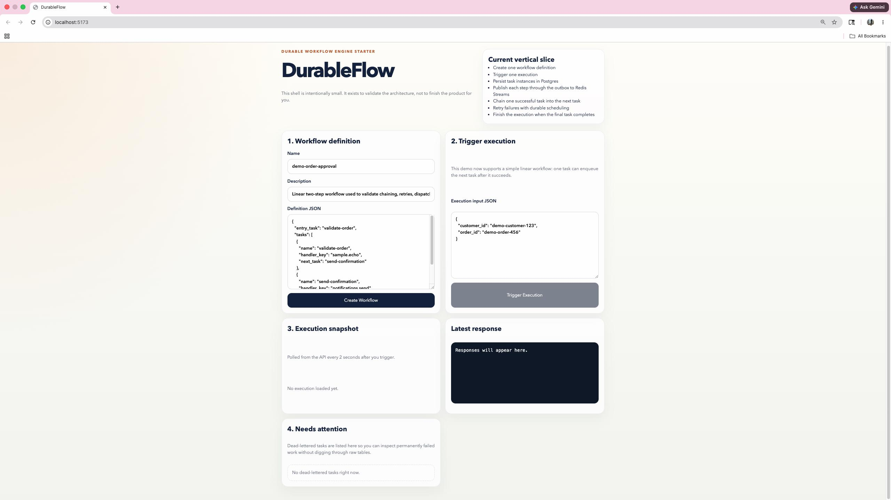
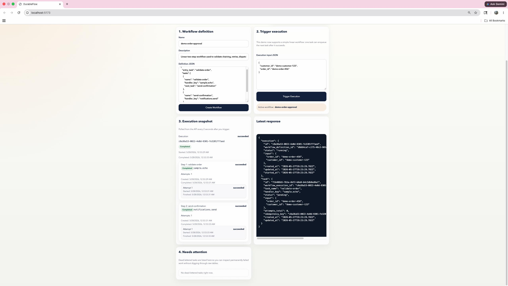
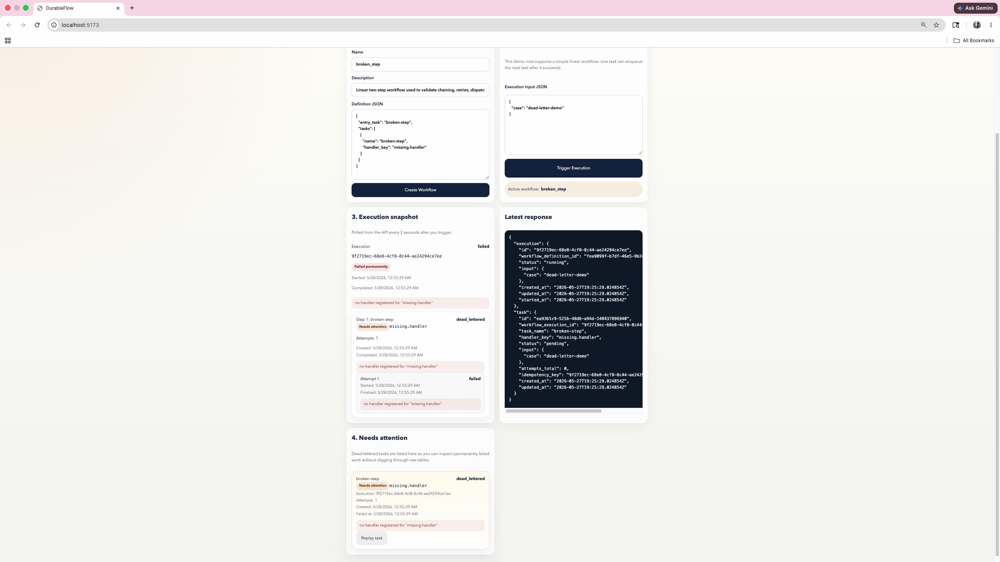
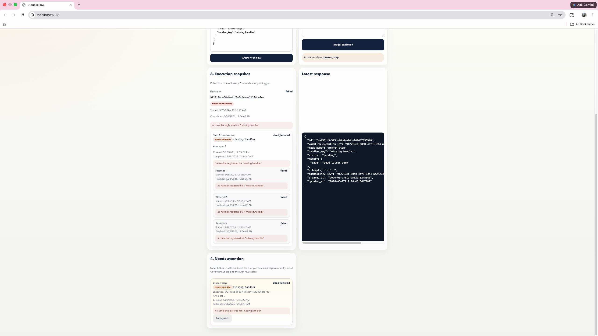

# DurableFlow

DurableFlow is a fault-tolerant workflow orchestration engine built to explore the parts of distributed systems that are easy to ignore in smaller backend projects and very hard to ignore in production systems: durable state, retries, duplicate delivery, dead-letter handling, crash recovery, and idempotency.

This project is intentionally not a toy queue consumer with a dashboard. It is designed around one opinionated rule:

- Postgres is the source of truth.
- Redis Streams is transport, not truth.
- Delivery is at-least-once, so the system must tolerate duplicates.

That rule drives almost every important technical decision in the codebase.

## What the project does today

DurableFlow currently supports:

- workflow definition storage and validation
- execution creation from stored definitions
- transactional task creation plus outbox dispatch intent
- asynchronous task dispatch through Redis Streams
- durable task attempts and execution snapshots
- retry scheduling with persisted `next_run_at`
- outbox-based redispatch for delayed retries
- linear multi-step workflow chaining through `next_task`
- dead-lettered task handling with list and replay support
- Redis consumer-group recovery for stale pending messages
- handler-level idempotency backed by persisted reservations and stored responses
- a containerized multi-service local stack with Docker Compose
- focused tests around orchestration, handler idempotency, worker failure paths, and Redis recovery logic

In practical terms, a workflow can be created, triggered, dispatched asynchronously, retried safely, recovered after failure, replayed after dead-lettering, and inspected end to end.

## Why this project is technically interesting

Many workflow systems look simple until something goes wrong. The hard problems start when:

- a process crashes after writing state but before publishing work
- a worker receives the same message twice
- a task fails and needs delayed retry instead of immediate failure
- a human needs to inspect permanently failed work and replay it safely
- a recovered worker picks up a message that was abandoned by another worker
- a handler touches an external side effect and must not repeat it accidentally

DurableFlow tackles those problems directly instead of treating them as future cleanup work.

The project demonstrates:

- transactional outbox design
- durable workflow and task state modeling
- at-least-once delivery semantics
- retry scheduling from persisted timestamps instead of in-memory sleeps
- Postgres-backed dead-letter workflows
- manual replay through the same dispatch pipeline
- stale-message reclaim with Redis consumer groups
- task-owned idempotency reservations for side-effect safety

## The most important design decisions

### 1. Postgres is authoritative

Workflow definitions, executions, task instances, attempts, retry state, dead-letter state, outbox rows, and idempotency records all live in Postgres.

That means:

- the system can survive process restarts without losing workflow truth
- async delivery can be retried independently of business state
- operators can inspect what happened from the database, not only from logs

### 2. Redis Streams is used only for delivery

Redis is valuable here because it gives us asynchronous transport and consumer groups, but it is intentionally not trusted as the source of workflow truth.

If Redis says a message exists but Postgres says the task is already complete, Postgres wins.

### 3. Every dispatch path flows through the outbox

The outbox is not only for first-run task dispatch. It is also used for:

- retry redispatch
- dead-letter replay
- next-task progression in a workflow chain

That keeps the write path consistent and drastically reduces the number of “special case” delivery mechanisms.

### 4. Idempotency is explicit, not implied

The built-in handlers do not rely on wishful thinking around duplicate delivery. They reserve durable idempotency keys in Postgres, store successful responses, and allow the same task instance to resume work safely after retries or crash recovery.

## End-to-end flow

At a high level, one execution looks like this:

1. A workflow definition is created through the API.
2. An execution is triggered against that stored definition.
3. The API writes:
   - a `workflow_executions` row
   - an initial `task_instances` row
   - an `outbox_events` row
4. The outbox publisher reads the undispatched outbox row and publishes a Redis Streams message.
5. The worker consumes the message, loads authoritative task state from Postgres, and records a `task_attempts` row.
6. The handler runs.
7. On success:
   - the current task attempt is completed
   - the current task is completed
   - the next task is enqueued if `next_task` exists
   - otherwise the workflow execution is completed
8. On failure:
   - the task is either scheduled for retry with `next_run_at`
   - or marked `dead_lettered` if retries are exhausted
9. A dead-lettered task can later be replayed manually, which pushes it back into the same outbox-driven dispatch path.

## Failure and recovery paths

The project is strongest in the places where small systems usually break.

### Retry scheduling

Retries are not implemented as “sleep and try again.” A failed task is moved back to `pending`, its next eligible execution time is written into `task_instances.next_run_at`, and a scheduler loop materializes a new outbox event once that time arrives.

That design matters because it survives restarts cleanly.

### Dead-letter and replay

If retries are exhausted, the task is marked `dead_lettered` and the workflow execution is marked `failed`. Dead-lettered tasks are queryable through the API and visible in the dashboard. Replay resets the task to a runnable state and pushes it back through the outbox so recovery uses the same durable machinery as initial execution.

### Crash recovery

If a worker crashes after claiming a Redis Streams message, that message can remain pending in the consumer group. DurableFlow uses Redis `XAUTOCLAIM` to reclaim stale pending deliveries and route them back through the worker path. The worker still consults Postgres before doing work, so reclaimed deliveries do not blindly repeat already-finished tasks.

### Idempotency

The built-in handlers use `idempotency_records` to reserve and complete side-effect boundaries. If the same handler is invoked again with the same logical idempotency key:

- a completed response can be reused
- the same task instance can resume its own in-progress reservation
- a different duplicate task instance is blocked from repeating the side effect

That is one of the most important correctness guarantees in the project.

## Current system shape

### Services

- `api`: HTTP API plus outbox publisher
- `worker`: Redis Streams consumer and task executor
- `web`: React dashboard for workflow creation, inspection, dead-letter visibility, and replay

### Infrastructure in the local stack

- Postgres
- Redis
- OpenTelemetry collector
- Prometheus
- Grafana

The stack is meant to run as a reproducible local distributed system, not as a set of disconnected code samples. Docker Compose brings up the API, worker, web dashboard, Postgres, Redis, and observability services together so retry behavior, replay, crash recovery, and inspection can be exercised end to end.

### Core persistence model

- `workflow_definitions`
- `workflow_executions`
- `task_instances`
- `task_attempts`
- `outbox_events`
- `idempotency_records`

## Dashboard walkthrough

The dashboard is intentionally small, but each panel maps directly to a core part of the system:

- workflow definition creation
- execution triggering
- execution snapshot inspection
- dead-letter visibility and replay

### 1. Overview

The overview screen shows the full operator surface in its empty state: create a workflow, trigger an execution, inspect the latest API response, and monitor dead-lettered tasks from one place.



### 2. Successful multi-step execution

This state shows a completed linear workflow. The execution snapshot captures both task instances, their attempts, timestamps, and final `succeeded` status while the response panel shows the latest API payload that drove the UI.



### 3. Dead-letter handling

This state shows a workflow that failed terminally because its handler was intentionally missing. The execution snapshot shows the task as `dead_lettered`, preserves attempt history, and surfaces the terminal error without needing to inspect the database directly.



### 4. Replay flow

Replay takes a dead-lettered task, moves it back into the durable dispatch path, and shows the updated state in the same UI. This is useful for recovery demos because replay is not a special one-off command; it reuses the same outbox-driven execution machinery as the original run.



## Repository map

```text
apps/
  api/       API entrypoint and outbox loop
  worker/    Worker entrypoint and task execution path
  web/       React operations dashboard
internal/
  config/       environment and runtime configuration
  db/           Postgres access, migrations, idempotency store
  domain/       shared domain models and statuses
  handlers/     sample handlers and idempotency-aware side effects
  httpapi/      HTTP routing and JSON handlers
  orchestrator/ workflow creation and worker orchestration logic
  outbox/       durable outbox polling and publish logic
  queue/        Redis Streams adapter and stale-message reclaim
  telemetry/    tracing and metrics bootstrap
migrations/     SQL schema evolution
deployments/    local observability config
```

## How to read the codebase

Suggested reading order:

1. [ARCHITECTURE.md](ARCHITECTURE.md) for the design and invariants
2. [migrations/001_init.sql](migrations/001_init.sql) and later migrations for the real data model
3. [internal/orchestrator/service.go](internal/orchestrator/service.go) for execution creation
4. [internal/outbox/publisher.go](internal/outbox/publisher.go) for durable dispatch
5. [internal/orchestrator/worker.go](internal/orchestrator/worker.go) for retry, chaining, and failure behavior
6. [internal/queue/redis_streams.go](internal/queue/redis_streams.go) for consumer-group delivery and reclaim
7. [internal/db/idempotency.go](internal/db/idempotency.go) for the side-effect safety contract

## Local setup

### Prerequisites

- Docker
- Docker Compose v2

Optional for running services outside Docker:

- Go 1.23+
- Node 22+ with npm

### Start the stack

```bash
cp .env.example .env
docker compose up --build
```

## Verification

The codebase is built to be runnable and checkable, not just readable:

- backend behavior is validated with `go test ./...`
- the dashboard is validated with a production build via `npm --prefix apps/web run build`
- the local stack includes OpenTelemetry, Prometheus, and Grafana so service behavior can be inspected in a realistic multi-service setup

The current tests focus on the areas where correctness matters most:

- workflow orchestration helpers
- worker success, retry, and dead-letter branches
- handler-level idempotency behavior
- Redis consumer-group reclaim and queue decoding helpers

### Local endpoints

- Dashboard: [http://localhost:5173](http://localhost:5173)
- API health: [http://localhost:8080/healthz](http://localhost:8080/healthz)
- Worker health: [http://localhost:8081/healthz](http://localhost:8081/healthz)
- Prometheus: [http://localhost:9090](http://localhost:9090)
- Grafana: [http://localhost:3000](http://localhost:3000)

## Minimal API examples

Create a workflow:

```bash
curl -X POST http://localhost:8080/api/workflows \
  -H 'Content-Type: application/json' \
  -d '{
    "name": "demo-order-flow",
    "description": "Linear workflow demo",
    "definition": {
      "entry_task": "validate-order",
      "tasks": [
        {
          "name": "validate-order",
          "handler_key": "sample.echo",
          "next_task": "send-notification",
          "max_attempts": 3,
          "backoff_seconds": 10
        },
        {
          "name": "send-notification",
          "handler_key": "notifications.send"
        }
      ]
    }
  }'
```

Trigger an execution:

```bash
curl -X POST http://localhost:8080/api/executions \
  -H 'Content-Type: application/json' \
  -d '{
    "workflow_definition_id": "<workflow-definition-id>",
    "input": {
      "order_id": "demo-order-123",
      "customer_email": "demo@example.com"
    }
  }'
```

Inspect one execution:

```bash
curl http://localhost:8080/api/executions/<execution-id>
```

List dead-lettered tasks:

```bash
curl http://localhost:8080/api/dead-letter-tasks?limit=10
```

Replay one dead-lettered task:

```bash
curl -X POST http://localhost:8080/api/tasks/<task-id>/replay
```

## Current scope and limitations

DurableFlow already proves that the core durability and failure-handling architecture works for a real vertical slice. It is strong on correctness boundaries and operational recovery.

It does not yet attempt to be a full Temporal-style workflow platform.

The main deliberate limitations today are:

- workflow chaining is linear, not a general DAG
- workflow definitions are not versioned yet
- the dashboard is operationally useful but still lightweight
- replay exists, but there is no richer operator audit console yet

Those gaps are intentional. The difficult infrastructure pieces were built first so later product features can sit on something solid.

## What to read next

- [ARCHITECTURE.md](ARCHITECTURE.md) for a deeper explanation of the system design
- [TASKS.md](TASKS.md) for the implementation history and remaining roadmap
