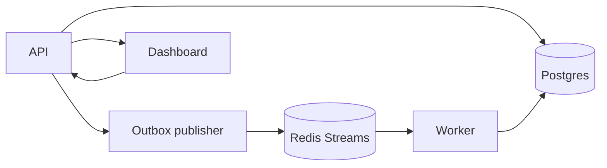

# DurableFlow

[](https://github.com/codetitan9999/DurableWorkFlowEngine/actions/workflows/ci.yml)

DurableFlow is a Go-based workflow engine for multi-step background jobs. It uses Postgres for durable execution state, Redis Streams for async delivery, and a small React dashboard for inspection and replay.

Quick links: [Architecture](ARCHITECTURE.md) · [Dashboard walkthrough](#dashboard-walkthrough) · [Postman setup](docs/postman/README.md) · [Benchmarks](docs/benchmarks.md) · [Operations](docs/operations.md) · [Changelog](CHANGELOG.md)

## Why this project exists

Background jobs look easy until failure shows up in the middle:

- state is written but work is not published
- a task is delivered more than once
- retries need to survive restarts
- a permanently failed task needs safe replay
- a worker crashes after claiming a message

DurableFlow is a small project built to handle those cases explicitly.

## What it supports

- transactional outbox-based dispatch
- durable retries with persisted `next_run_at`
- dead-letter handling and replay
- Redis consumer-group reclaim with `XAUTOCLAIM`
- handler-level idempotency for duplicate-safe side effects
- execution snapshots and a lightweight operations dashboard

## Core idea

- Postgres is the source of truth.
- Redis Streams is transport, not truth.
- Delivery is at-least-once, so the system must tolerate duplicates.

## Quick proof

- workflow state, attempts, retries, dead-letter state, and idempotency records are stored in Postgres
- every dispatch path goes through the outbox, including retries and replay
- reclaimed Redis messages are checked against Postgres before work is run again
- duplicate side effects are blocked through persisted idempotency reservations and stored responses

## System at a glance



## Start here

If you are skimming the repo, this is the fastest path:

1. Read [ARCHITECTURE.md](ARCHITECTURE.md).
2. Scan the [dashboard walkthrough](#dashboard-walkthrough).
3. Use the [Postman collection](docs/postman/README.md).
4. Open [docs/benchmarks.md](docs/benchmarks.md) and [docs/operations.md](docs/operations.md) if you want the measurement and observability details.

## Dashboard walkthrough

### 1. Overview

Create a workflow, trigger an execution, inspect the latest API response, and monitor dead-lettered tasks from one place.


### 2. Successful multi-step execution

Completed linear workflow with both task instances and final `succeeded` status visible in the execution snapshot.


### 3. Dead-letter handling

Terminal failure with attempt history, error details, and dead-letter visibility in the same UI.


### 4. Replay flow

Replay moves a dead-lettered task back through the normal durable dispatch path instead of using a special recovery shortcut.


## Tech highlights

- workflow definition storage and validation
- execution creation from stored definitions
- transactional task creation plus outbox dispatch intent
- asynchronous task dispatch through Redis Streams
- durable task attempts and execution snapshots
- retry scheduling with persisted `next_run_at`
- outbox-based redispatch for delayed retries
- linear multi-step workflow chaining through `next_task`
- dead-lettered task handling with list and replay support
- Redis consumer-group recovery for stale pending messages
- handler-level idempotency backed by persisted reservations and stored responses
- a containerized multi-service local stack with Docker Compose
- focused unit and integration tests around orchestration, outbox dispatch, retry scheduling, replay, idempotency conflicts, and Redis recovery logic

## Stack

### Services

- `api`: HTTP API plus outbox publisher
- `worker`: Redis Streams consumer and task executor
- `web`: React dashboard for workflow creation, inspection, dead-letter visibility, and replay

### Infrastructure in the local stack

- Postgres
- Redis
- OpenTelemetry collector
- Prometheus
- Grafana

For scaling benchmarks, the compose file also includes a `worker-bench` profile that starts extra consumers in the same Redis group without publishing additional host ports.

### Core tables

- `workflow_definitions`
- `workflow_executions`
- `task_instances`
- `task_attempts`
- `outbox_events`
- `idempotency_records`

## Repository map

```text
apps/
  api/       API entrypoint and outbox loop
  worker/    Worker entrypoint and task execution path
  web/       React operations dashboard
internal/
  config/       environment and runtime configuration
  db/           Postgres access, migrations, idempotency store
  domain/       shared domain models and statuses
  handlers/     sample handlers and idempotency-aware side effects
  httpapi/      HTTP routing and JSON handlers
  orchestrator/ workflow creation and worker orchestration logic
  outbox/       durable outbox polling and publish logic
  queue/        Redis Streams adapter and stale-message reclaim
  telemetry/    tracing and metrics bootstrap
migrations/     SQL schema evolution
deployments/    local observability config
```

## Where to look in code

- [ARCHITECTURE.md](ARCHITECTURE.md) for the design and invariants
- [migrations/001_init.sql](migrations/001_init.sql) for the data model
- [internal/orchestrator/service.go](internal/orchestrator/service.go) for execution creation
- [internal/outbox/publisher.go](internal/outbox/publisher.go) for dispatch
- [internal/orchestrator/worker.go](internal/orchestrator/worker.go) for retry, chaining, and failure handling
- [internal/queue/redis_streams.go](internal/queue/redis_streams.go) for Redis Streams delivery and reclaim
- [internal/db/idempotency.go](internal/db/idempotency.go) for idempotency ownership and stored responses

## Quick start

### Prerequisites

- Docker
- Docker Compose v2

Optional for running services outside Docker:

- Go 1.23+
- Node 22+ with npm

### Start the stack

```bash
cp .env.example .env
docker compose up --build
```

## Local endpoints

- Dashboard: [http://localhost:5173](http://localhost:5173)
- API health: [http://localhost:8080/healthz](http://localhost:8080/healthz)
- Worker health: [http://localhost:8081/healthz](http://localhost:8081/healthz)
- Prometheus: [http://localhost:9090](http://localhost:9090)
- Grafana: [http://localhost:3000](http://localhost:3000)

## Validate locally

- Run backend tests with `go test ./...`
- Build the web app with `npm --prefix apps/web run build`
- Use the [Postman collection](docs/postman/README.md) for API checks
- See [docs/benchmarks.md](docs/benchmarks.md) for load runs
- See [docs/operations.md](docs/operations.md) for observability and runbook checks

## Minimal API examples

Create a workflow:

```bash
curl -X POST http://localhost:8080/api/workflows \
  -H 'Content-Type: application/json' \
  -d '{
    "name": "demo-order-flow",
    "description": "Linear workflow demo",
    "definition": {
      "entry_task": "validate-order",
      "tasks": [
        {
          "name": "validate-order",
          "handler_key": "sample.echo",
          "next_task": "send-notification",
          "max_attempts": 3,
          "backoff_seconds": 10
        },
        {
          "name": "send-notification",
          "handler_key": "notifications.send"
        }
      ]
    }
  }'
```

Trigger an execution:

```bash
curl -X POST http://localhost:8080/api/executions \
  -H 'Content-Type: application/json' \
  -d '{
    "workflow_definition_id": "<workflow-definition-id>",
    "input": {
      "order_id": "demo-order-123",
      "customer_email": "demo@example.com"
    }
  }'
```

Inspect one execution:

```bash
curl http://localhost:8080/api/executions/<execution-id>
```

List dead-lettered tasks:

```bash
curl http://localhost:8080/api/dead-letter-tasks?limit=10
```

Replay one dead-lettered task:

```bash
curl -X POST http://localhost:8080/api/tasks/<task-id>/replay
```

## Current scope and known limitations

DurableFlow covers a meaningful slice of durable execution, failure handling, and operational recovery in a local multi-service setup.

It is still a focused exploration project, not a production-ready workflow platform.

Current product-scope limits:

- workflow chaining is linear, not a general DAG
- workflow definitions are not versioned yet
- the dashboard is useful for inspection and replay, but it is still lightweight
- replay exists, but there is no richer operator audit trail yet

Current engineering limits:

- running-task recovery still depends on message redelivery plus Postgres state checks; there is no separate lease or heartbeat model for long-running tasks
- the outbox path works well in the current single-API local shape, but multi-publisher coordination has not been stress-tested
- tests are strongest around orchestration and handler behavior; database and outbox integration coverage is still thinner than I would want for a production system
- benchmark numbers describe local Docker-based behavior and should not be read as production-scale claims

If I kept pushing this project, the next improvements would be stronger DB/outbox integration tests, clearer replay audit history, and a more explicit recovery model for long-running tasks.

## Performance and Boundaries

The project includes local benchmark runs against the real API, outbox publisher, Redis Streams path, and worker execution path. The goal of these runs is to show how the current implementation behaves under load and where the first bottlenecks appear.

### Default runtime shape

With the default `OUTBOX_POLL_INTERVAL=2s`, the `2-step` happy-path workflow plateaued at roughly `~5 exec/s`:

- `120` executions, concurrency `30`: `4.99 exec/s`, reported latency avg `5.79s`, p95 `5.98s`
- `240` executions, concurrency `60`: `4.99 exec/s`, reported latency avg `11.47s`, p95 `11.99s`

This lines up with the current design:

- outbox publisher drains up to `20` rows per poll
- default poll interval is `2s`
- a `2-step` workflow needs `2` dispatches per execution
- theoretical ceiling is therefore about `~5 exec/s`

### Tuned runtime shape

To check whether that ceiling came from the overall design or from a specific runtime setting, the API was rerun with `OUTBOX_POLL_INTERVAL=100ms` and no code changes. Under that tuned setting, the same `2-step` workflow sustained roughly `~99 exec/s`:

- `240` executions, concurrency `60`: `97.30 exec/s`, avg `462ms`, p95 `524ms`
- `1000` executions, concurrency `200`: `98.92 exec/s`, avg `1.80s`, p95 `1.97s`
- `5000` executions, concurrency `500`, `1s` polling: `99.28 exec/s`, avg `4.43s`, p95 `4.92s`
- `10000` executions, concurrency `1000`, `1s` polling: `99.45 exec/s`, avg `9.26s`, p95 `9.86s`

This suggests that the first boundary in the default setup was mainly publisher cadence, not worker count.

### Failure-path behavior

The benchmark suite also measured the failure and recovery paths:

- persisted retries, `3` attempts, `1s` backoff: `0.53 exec/s` by default and `1.25 exec/s` under the tuned outbox cadence, with exactly `3` attempts per execution
- immediate dead-letter on missing handler: `1.38 exec/s`, avg `1.58s`, p95 `1.83s`
- replay of a dead-lettered task through the normal dispatch path: avg `3.77s`, p95 `3.93s`, with exactly `2` attempts per execution

### Crash recovery

One run intentionally stopped the only worker mid-flight, waited through the reclaim window, then restarted it:

- all `20/20` executions still succeeded
- throughput dropped to `0.29 exec/s`
- reported latency avg rose to `16.77s`
- reported latency p95 rose to `55.82s`
- attempts per execution still stayed at `2`

This shows that consumer failure can delay work significantly while the system still recovers without losing work.

### Soak and mixed workload checks

The default `100 exec / 20 concurrency` happy-path shape was also repeated `30` times as a soak run:

- throughput avg stayed at `5.01 exec/s`
- reported latency p95 avg stayed at `3.95s`
- first-5 vs last-5 run averages stayed nearly flat

A mixed workload run combined success, retry, dead-letter, and replay traffic in parallel:

- happy-path throughput dropped to `3.64 exec/s`
- happy-path reported p95 stayed near the normal range at `3.90s`

That suggests mixed failure traffic reduced the share of throughput available to the happy path before it caused a major latency spike.

### Multi-worker benchmarks

The repo now includes a scale-only `worker-bench` profile for multi-worker runs. With the API kept in the tuned `OUTBOX_POLL_INTERVAL=100ms` shape:

- `1000` executions at concurrency `200` with `1` worker averaged `98.95 exec/s`
- the same workload with `3` workers averaged `99.39 exec/s`

At this workload and with the built-in handlers, extra workers did not materially change throughput.

One extra worker was also stopped during a tuned run while the rest of the consumer group stayed alive:

- `500` executions at concurrency `100`
- throughput stayed at `98.14 exec/s`
- reported latency p95 stayed under `1s`

That is very different from losing the only worker, and it shows the consumer group can absorb partial worker loss without a large drop in throughput.

### Current boundary story

At this point, the current measurements suggest:

- default-shape throughput is outbox-cadence bound at about `~5 exec/s`
- tuned happy-path throughput sustains about `~99 exec/s` in the local environment for the current `2-step` workflow
- the default happy-path shape stays stable over repeated soak runs without meaningful drift in throughput or tail latency
- adding more workers did not materially improve the tuned happy-path benchmark for the current handlers, which suggests the next bottleneck is still upstream of raw worker parallelism
- mixed success, retry, dead-letter, and replay traffic reduces happy-path throughput before it causes a large p95 latency jump
- under extremely aggressive snapshot polling, the control-plane read path becomes a separate limit before the workflow engine itself fails

The full methodology, scenario list, and measured results live in [docs/benchmarks.md](docs/benchmarks.md).

### Reproducing benchmark runs

The repo includes a small benchmark runner plus helper scripts:

- [scripts/run_bench_suite.sh](scripts/run_bench_suite.sh)
- [scripts/generate_benchmark_charts.sh](scripts/generate_benchmark_charts.sh)
- [benchmarks/results/2026-06-05/charts.md](benchmarks/results/2026-06-05/charts.md)
- [docs/operations.md](docs/operations.md)

Useful commands:

```bash
make bench-suite
make bench-charts
make metrics-api
make metrics-worker
make metrics-rules
```

The generated chart report turns one results directory of JSON artifacts into a small Mermaid-based summary that is easy to review in GitHub.

## What to read next

- [ARCHITECTURE.md](ARCHITECTURE.md) for a deeper explanation of the system design
- [TASKS.md](TASKS.md) for the implementation history and remaining roadmap
