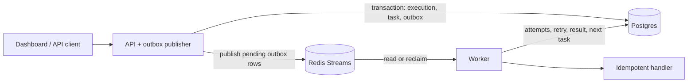
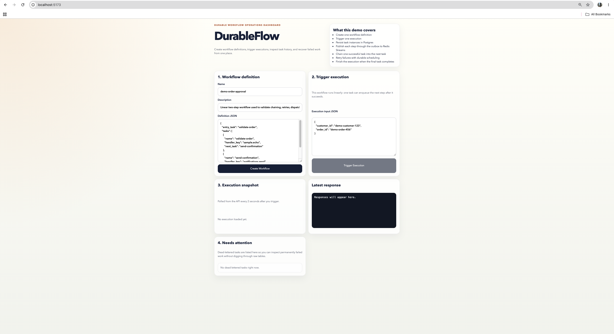

# DurableFlow

[](https://github.com/codetitan9999/DurableWorkFlowEngine/actions/workflows/ci.yml)

DurableFlow is a small workflow engine for multi-step background jobs, built in Go with Postgres, Redis Streams, and a React operations dashboard. It demonstrates how to make retries, crash recovery, replay, and duplicate-safe side effects explicit instead of hiding them behind a queue.

**The one-minute insight:** Postgres decides what should happen; Redis delivers opportunities to do the work. Because delivery is at least once, workers re-check durable state and handlers protect side effects with persisted idempotency records.

[Architecture](ARCHITECTURE.md) · [API walkthrough](docs/postman/README.md) · [Benchmarks](docs/benchmarks.md) · [Operations](docs/operations.md) · [Changelog](CHANGELOG.md)

## Why durable workflows are hard

A background job is straightforward until failure lands between two operations:

- the database commit succeeds but queue publication does not
- a worker performs work and crashes before acknowledging the message
- a retry is scheduled and the process restarts
- a permanently failed task needs to be repaired and replayed safely

DurableFlow handles these cases with three invariants:

1. **Postgres is authoritative.** Executions, tasks, attempts, retry times, dead-letter state, dispatch intent, and idempotency records are durable.
2. **Every dispatch uses the transactional outbox.** Initial tasks, retries, next steps, and replays all enter Redis through the same path.
3. **Duplicate delivery is expected.** Workers consult Postgres before execution; side-effecting handlers reserve durable idempotency keys.

## Architecture


```mermaid
flowchart LR
    Client["Dashboard / API client"] --> API["API + outbox publisher"]
    API -->|transaction: execution, task, outbox| PG[("Postgres")]
    API -->|publish pending outbox rows| Redis[("Redis Streams")]
    Redis -->|read or reclaim| Worker["Worker"]
    Worker -->|attempts, retry, result, next task| PG
    Worker --> Handler["Idempotent handler"]
```

A workflow run follows one durable loop:

1. The API stores an execution, its first task, and an outbox row in one transaction.
2. The publisher sends pending outbox events to a Redis consumer group.
3. A worker loads authoritative task state, records an attempt, and runs the handler.
4. Success creates the next task or completes the execution. Failure persists a future `next_run_at` or dead-letters the task.
5. A crashed worker's pending message can be reclaimed with `XAUTOCLAIM`; replay resets eligible state and re-enters through the outbox.

See [ARCHITECTURE.md](ARCHITECTURE.md) for lifecycle diagrams, data-model details, and code entry points.

## What is implemented

- Definition-driven, linear multi-step workflows
- Durable attempts and scheduled retries that survive restarts
- Dead-letter inspection and replay through the normal dispatch path
- Redis consumer-group recovery for stale pending messages
- Handler-level idempotency with stored successful responses
- Execution snapshots, OpenTelemetry metrics, Prometheus alerts, Grafana, and a lightweight React dashboard
- Unit and integration coverage for orchestration, dispatch, retries, replay, idempotency, and reclaim logic



## Evidence, with boundaries

The repository includes a benchmark harness that drives the real HTTP API and waits for terminal execution snapshots.

| Local Docker scenario | Result | What it supports |
| --- | ---: | --- |
| 2-step workflow, default `2s` outbox polling | ~5 executions/s | Publisher cadence is the first default bottleneck |
| 2-step workflow, `100ms` polling, 1,000 runs at concurrency 200 | ~99 executions/s | Tuned local happy-path capacity |
| 3 workers with 1 interrupted, 500 runs at concurrency 100 | ~98 executions/s; p95 942 ms | Remaining consumers absorb partial worker loss |
| Only worker interrupted, 20 runs | All succeeded; p95 55.82 s | Reclaim restores work, with a substantial latency cost |

These are **local Docker measurements, not production claims**. The ~5 and ~99 results use different workloads as well as different poll intervals, so they identify outbox cadence as a bottleneck; they do not establish a general “20× faster” claim. Full workloads, methodology, failure-path results, soak data, and caveats are in [docs/benchmarks.md](docs/benchmarks.md).

## Run locally

Prerequisites: Docker and Docker Compose v2.

```bash
cp .env.example .env
docker compose up --build
```

Then open:

- Dashboard: [http://localhost:5173](http://localhost:5173)
- API health: [http://localhost:8080/healthz](http://localhost:8080/healthz)
- Worker health: [http://localhost:8081/healthz](http://localhost:8081/healthz)
- Grafana: [http://localhost:3000](http://localhost:3000) (`admin` / `admin`)

Import the included [Postman collection and local environment](docs/postman/README.md) to create a workflow, trigger an execution, inspect its snapshot, and exercise dead-letter replay.

For a source-level check:

```bash
go test ./...
npm --prefix apps/web ci
npm --prefix apps/web run build
```

## Scope and tradeoffs

DurableFlow intentionally favors a clear durability model over broad workflow syntax. Chaining is linear rather than a general DAG; definitions are not versioned; long-running tasks have no separate lease or heartbeat; multi-publisher behavior has not been stress-tested; and replay lacks a richer operator audit trail.

## Go deeper

- [Architecture](ARCHITECTURE.md): invariants, components, data model, lifecycle, and code map
- [Happy path](docs/happy-path.md): shortest source-guided execution trace
- [Benchmarks](docs/benchmarks.md): methodology, full results, rerun commands, and caveats
- [Operations](docs/operations.md): health checks, metrics, alerts, and incident guidance
- [Postman setup](docs/postman/README.md): runnable API happy path and replay flow
- [Implementation history and roadmap](TASKS.md): completed work and remaining tasks
