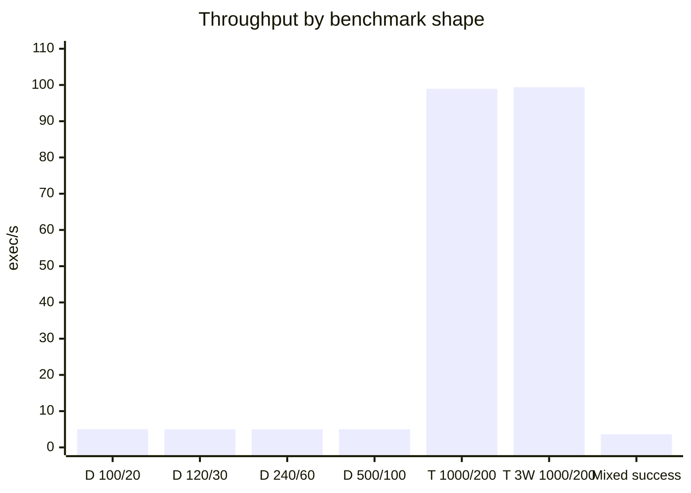
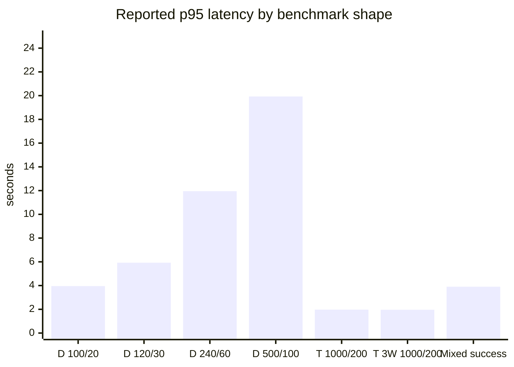
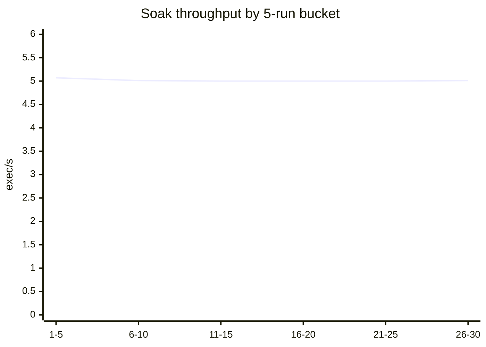
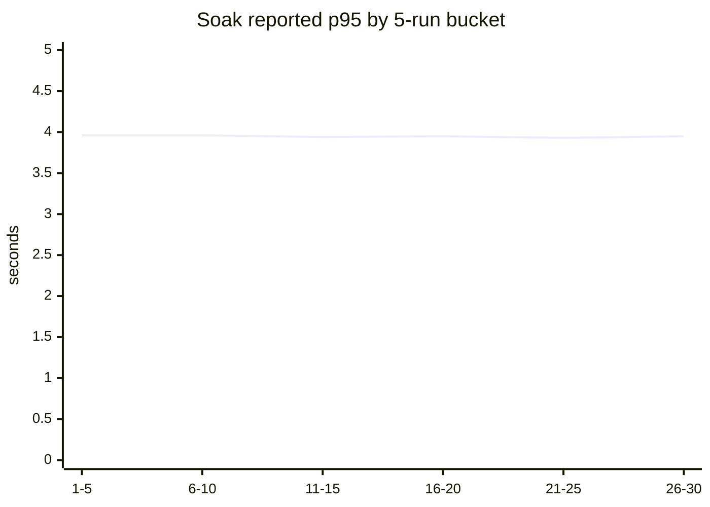
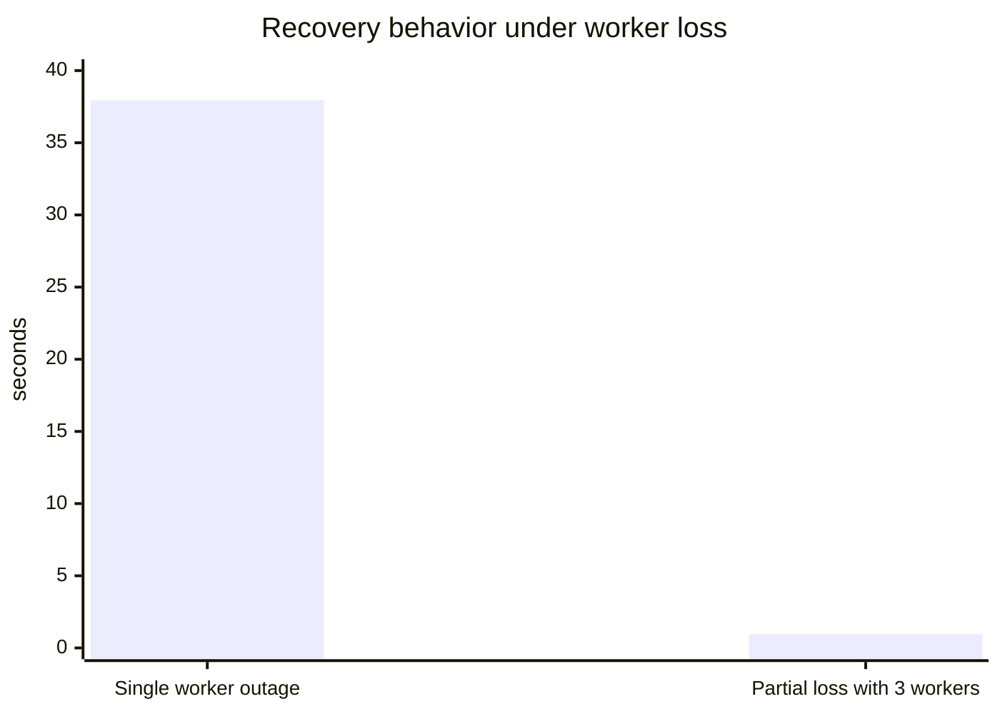
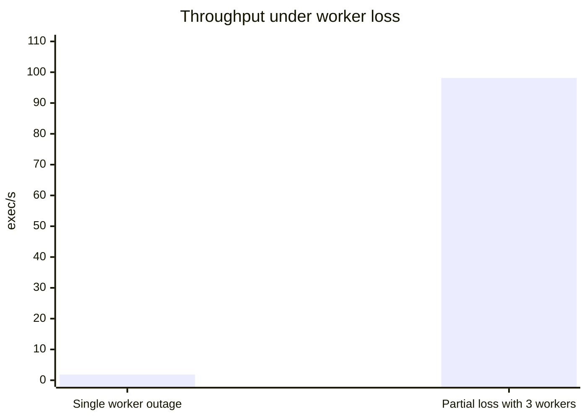

# Benchmark Charts

Source directory: `benchmarks/results/2026-06-05`

## Throughput comparison

```mermaid
xychart-beta
    title "Throughput by benchmark shape"
    x-axis ["D 100/20", "D 120/30", "D 240/60", "D 500/100", "T 1000/200", "T 3W 1000/200", "Mixed success"]
    y-axis "exec/s" 0 --> 110
    bar [5.027982012509506, 5.0058818856886385, 5.0085230845226425, 5.007395514453039, 98.9545796623877, 99.39135560201403, 3.6376535229810374]
```

## Tail latency comparison

```mermaid
xychart-beta
    title "Reported p95 latency by benchmark shape"
    x-axis ["D 100/20", "D 120/30", "D 240/60", "D 500/100", "T 1000/200", "T 3W 1000/200", "Mixed success"]
    y-axis "seconds" 0 --> 25
    bar [3.9567296, 5.929042333, 11.954865333, 19.928305, 1.973832, 1.964453666, 3.903254]
```

## Soak drift

```mermaid
xychart-beta
    title "Soak throughput by 5-run bucket"
    x-axis ["1-5", "6-10", "11-15", "16-20", "21-25", "26-30"]
    y-axis "exec/s" 0 --> 6
    line [5.07, 5.01, 5, 5, 5, 5.01]
```

```mermaid
xychart-beta
    title "Soak reported p95 by 5-run bucket"
    x-axis ["1-5", "6-10", "11-15", "16-20", "21-25", "26-30"]
    y-axis "seconds" 0 --> 5
    line [3.96, 3.96, 3.94, 3.95, 3.93, 3.95]
```

## Failure and recovery comparison

```mermaid
xychart-beta
    title "Recovery behavior under worker loss"
    x-axis ["Single worker outage", "Partial loss with 3 workers"]
    y-axis "seconds" 0 --> 40
    bar [37.936539, 0.942725]
```

```mermaid
xychart-beta
    title "Throughput under worker loss"
    x-axis ["Single worker outage", "Partial loss with 3 workers"]
    y-axis "exec/s" 0 --> 110
    bar [1.8500021665837874, 98.14051047123877]
```
