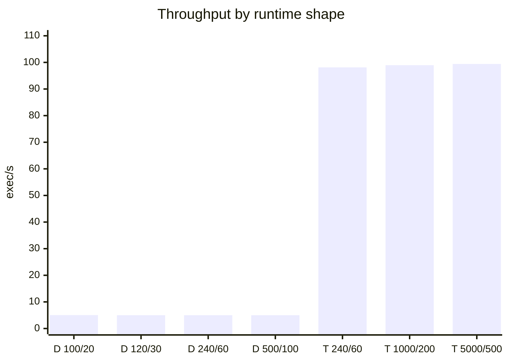
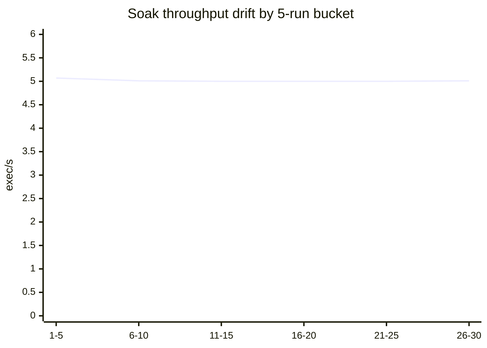
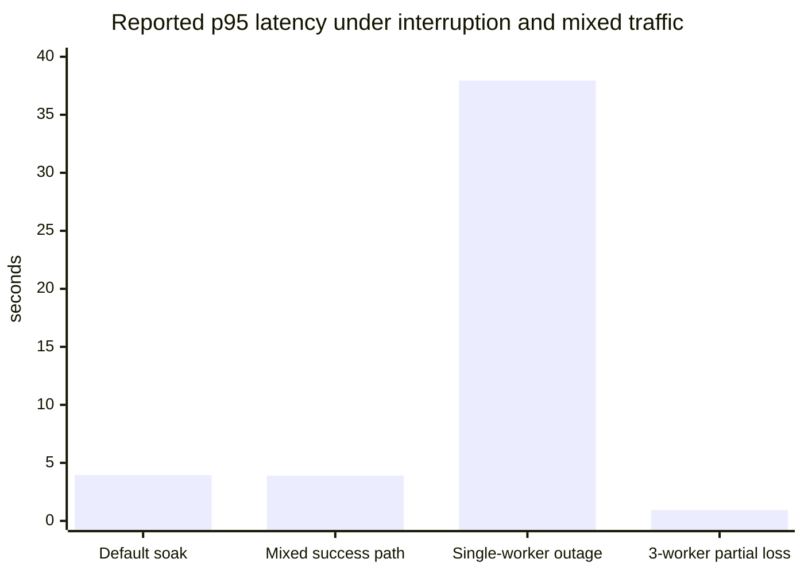

# DurableFlow Benchmarks

This document describes how DurableFlow is measured locally and what those measurements are meant to show.

The focus is on repeatable measurements for:

- end-to-end latency
- steady-state throughput
- concurrency behavior
- retry timing
- dead-letter timing
- crash-recovery semantics

These runs are meant to show how the current implementation behaves, where the first bottlenecks appear, and which parts of the system are sensitive to configuration.

## What is already true without benchmarking

These repo facts are useful background for the benchmark runs:

- `8` services in the local stack: `api`, `worker`, `web`, `postgres`, `redis`, `otel-collector`, `prometheus`, `grafana`
- `6` core workflow/state tables: `workflow_definitions`, `workflow_executions`, `task_instances`, `task_attempts`, `outbox_events`, `idempotency_records`
- `24` focused test cases across orchestration, handlers, queue decoding/recovery helpers, and API-path validation
- a workflow engine with explicit at-least-once delivery, durable retries, dead-letter replay, stale-message reclaim, and handler-level idempotency

These are useful implementation and correctness signals, but they do not say much about throughput or latency on their own.

## Benchmark harness

The repo includes a small benchmark runner at [cmd/bench/main.go](../cmd/bench/main.go).

For repeated suites and report generation, the repo also includes:

- [scripts/run_bench_suite.sh](../scripts/run_bench_suite.sh)
- [scripts/generate_benchmark_charts.sh](../scripts/generate_benchmark_charts.sh)

It does three things:

1. creates a benchmark workflow definition through the real API
2. triggers many executions concurrently
3. polls execution snapshots until terminal state, then computes summary statistics

It can also:

- repeat the same run multiple times with `-repeat`
- write a JSON suite report with `-output-file`
- keep per-execution detail with `-include-runs`

It reports two latency views:

- observed latency: request trigger until the harness sees a terminal snapshot
- reported engine latency: `started_at` to `completed_at` from the execution snapshot

The reported engine latency is usually the more stable number because it removes most snapshot-poll noise.

Example:

```bash
go run ./cmd/bench \
  -scenario success-linear \
  -executions 100 \
  -concurrency 20 \
  -repeat 5 \
  -label baseline-happy-path \
  -output-file benchmarks/results/$(date +%F)/success-linear-baseline.json
```

That produces one JSON file containing:

- run configuration
- per-run summaries
- aggregate throughput and latency summaries across repeats

To run the default suite with the current script:

```bash
./scripts/run_bench_suite.sh
```

To generate a markdown chart report from one result directory:

```bash
./scripts/generate_benchmark_charts.sh benchmarks/results/2026-06-05
```

## Benchmark suite checklist

The most useful way to run this benchmark suite is as a set of named passes instead of isolated one-off commands.

### 1. Baseline

Purpose:

- establish a clean happy-path reference point
- capture throughput and latency with the default runtime shape

Recommended run:

```bash
go run ./cmd/bench \
  -scenario success-linear \
  -executions 100 \
  -concurrency 20 \
  -repeat 5 \
  -output-file benchmarks/results/$(date +%F)/baseline-success-linear.json
```

Record:

- throughput `avg`, `p95`, `max`
- reported latency `avg`, `p95`, `p99`
- attempts per execution

### 2. Load sweep

Purpose:

- find where latency starts bending under increasing load
- see whether throughput plateaus

Recommended matrix:

- executions: `100`, `500`, `1000`, `2000`, `5000`
- concurrency: `20`, `50`, `100`, `200`, `500`

For each point:

- run `repeat 3` or `repeat 5`
- save JSON output under the same date directory

### 3. Workflow-depth sweep

Purpose:

- see how latency scales with longer workflow chains
- check that attempts stay aligned with chain length on the happy path

Recommended matrix:

- chain length: `2`, `5`, `10`, `20`
- executions: `20`, `50`
- concurrency: `5`, `10`

### 4. Soak test

Purpose:

- check whether the system stays stable over time
- watch for throughput drift, backlog growth, or resource creep

Suggested approach:

- choose one stable happy-path configuration
- run it repeatedly for `10-30` minutes
- save each repeated run to JSON
- collect Prometheus metrics and container stats during the same window

Suggested signals:

- throughput drift between early and late runs
- latency drift
- worker or API restarts
- memory growth
- backlog that stops draining

### 5. Failure-injection pass

Purpose:

- verify that work is delayed rather than lost
- measure recovery cost under worker interruption

Suggested cases:

- stop the only worker while a `success-linear` run is active
- stop one worker in a multi-worker run
- delay replay until a dead-letter backlog exists

For each case, record:

- final success/failure counts
- recovery time
- latency inflation
- whether attempts stayed within expected bounds

### 6. Tuning sweep

Purpose:

- separate code-path limits from configuration limits
- explain which runtime settings move the first bottleneck

Parameters worth changing one at a time:

- `OUTBOX_POLL_INTERVAL`
- worker count
- benchmark poll interval
- retry backoff for retry-focused scenarios

Record:

- the baseline setting
- the changed setting
- throughput and latency deltas
- what did or did not improve

### 6a. Multi-worker pass

Purpose:

- compare one worker against a larger consumer group without changing the main local stack shape
- measure whether extra consumers help once publisher cadence is no longer the first bottleneck

Compose note:

- the default `worker` service publishes host port `8081`
- extra workers for benchmarking should be started through the `worker-bench` profile, which does not publish host ports

Start extra workers with:

```bash
docker compose --profile benchmark up -d --scale worker-bench=2 worker-bench
```

Then run the same benchmark shape used for the tuned single-worker comparison and compare the result with the original artifact.

### 7. Mixed workload pass

Purpose:

- see how the system behaves when success, retry, dead-letter, and replay traffic overlap

Current harness note:

- the harness runs one scenario per process
- a mixed workload can be created by running multiple benchmark processes at the same time in separate terminals

Suggested mix:

- `70%` success-linear
- `15%` retry-invalid-input
- `10%` dead-letter-missing-handler
- `5%` replay-missing-handler

Record:

- whether happy-path latency changes under failure traffic
- whether dead-letter or replay traffic causes noticeable backlog for normal traffic

### 8. Boundary report

Purpose:

- turn the raw runs into a short explanation of the system's current limits

For each major pass, summarize:

- where throughput plateaued
- when latency started rising sharply
- whether the bottleneck came from publisher cadence, worker count, polling load, or another factor
- whether the system recovered correctly after injected failure

This report is more useful than a single headline number because it explains how the system behaves as load and runtime conditions change.

## Supported scenarios

### 1. `success-linear`

Creates a two-step workflow:

- `validate-order` -> `sample.echo`
- `send-confirmation` -> `notifications.send`

This scenario is useful for measuring:

- happy-path latency
- steady-state throughput
- behavior under concurrent successful executions

### 2. `retry-invalid-input`

Creates a one-step workflow using `sample.echo` and intentionally passes invalid JSON shape (`123`) so the handler fails, schedules persisted retries, and eventually dead-letters after exhausting `max_attempts`.

This scenario is useful for measuring:

- retry timing
- attempts-to-terminal-failure behavior
- dead-letter latency under persisted backoff

### 3. `dead-letter-missing-handler`

Creates a one-step workflow with a missing handler and configurable retry settings.

This scenario is useful for measuring:

- immediate terminal-failure latency
- dead-letter visibility without retry overhead

### 4. `replay-missing-handler`

Creates a missing-handler workflow, waits for the dead-letter transition, triggers replay through the API, then measures the end-to-end time until the task reaches terminal failure again.

Use this scenario to measure:

- replay-path overhead
- whether replay truly re-enters the normal dispatch path

### 5. `success-deep-chain`

Creates a longer linear workflow chain with configurable `chain-length`.

Use this scenario to measure:

- how latency scales with workflow depth
- whether task-attempt counts stay aligned with chain length

## Recommended measurement runs

### A. Baseline happy path

Run:

```bash
go run ./cmd/bench \
  -scenario success-linear \
  -executions 25 \
  -concurrency 5
```

Capture:

- throughput in executions/sec
- reported latency `avg`, `p50`, `p95`
- attempts per execution

This gives a simple baseline for the happy path.

### B. Higher concurrency happy path

Run:

```bash
go run ./cmd/bench \
  -scenario success-linear \
  -executions 100 \
  -concurrency 20
```

Capture:

- throughput
- reported latency `p95`
- whether attempts stay at `2` per execution for the two-step workflow

This shows how the happy path behaves once multiple executions are active at the same time.

### C. Retry and dead-letter timing

Run:

```bash
go run ./cmd/bench \
  -scenario retry-invalid-input \
  -executions 20 \
  -concurrency 5 \
  -max-attempts 3 \
  -backoff-seconds 1
```

Capture:

- attempts per execution
- reported latency to terminal failure
- whether terminal state is consistently `failed`

This is useful for checking whether retries are actually being scheduled from durable state and whether terminal failure is consistent.

### D. Immediate dead-letter timing

Run:

```bash
go run ./cmd/bench \
  -scenario dead-letter-missing-handler \
  -executions 10 \
  -concurrency 3
```

Capture:

- terminal-failure latency
- attempts per execution

This isolates dead-letter overhead from retry scheduling.

### E. Replay timing

Run:

```bash
go run ./cmd/bench \
  -scenario replay-missing-handler \
  -executions 5 \
  -concurrency 2
```

Capture:

- latency from first run through replay and second terminal failure
- attempts per execution after replay

This gives a measurable replay result instead of only confirming that the flow works.

### F. Worker-scaling comparison

Start one run with the default single worker, then scale workers and repeat:

```bash
docker compose up -d
docker compose up -d --scale worker=3
```

Then rerun scenario B and compare:

- throughput change
- `p95` latency change

This shows whether the current design benefits from additional workers in the local setup.

### G. Crash-recovery validation

This is a useful non-throughput check because it exercises recovery behavior directly.

Suggested flow:

1. start a higher-concurrency `success-linear` run
2. kill the worker container while messages are in flight
3. restart or scale the worker back up
4. confirm reclaimed work completes without duplicate side effects
5. inspect:
   - execution snapshots
   - dead-letter list
   - Prometheus task metrics

The point of this scenario is to verify that:

- work was recovered after consumer failure
- reclaimed messages still respected task-state checks and idempotency boundaries

## Result storage

Keeping the raw results makes it much easier to compare runs later.

Suggested layout:

```text
benchmarks/results/
  2026-06-05/
    baseline-success-linear.json
    load-sweep-c100-e500.json
    load-sweep-c200-e1000.json
    tuning-outbox-100ms.json
    failure-worker-restart.json
```

Useful metadata to keep with each run:

- scenario
- executions
- concurrency
- repeat count
- poll interval
- timeout
- runtime setting changes such as `OUTBOX_POLL_INTERVAL`
- date and hostname

## Multi-worker benchmark shape

The repo now includes a `worker-bench` service in `docker-compose.yml` for scaling the consumer group without colliding on host port `8081`.

That keeps the normal local stack unchanged:

- `worker` still exposes `http://localhost:8081/healthz`
- `worker-bench` is only for benchmark runs and does not publish host ports

## How to read the output

Example:

```text
Scenario: success-linear
Executions: 100
Concurrency: 20
Throughput: 18.42 executions/sec

Reported engine latency (started_at -> completed_at)
  avg:   742ms
  p50:   701ms
  p95:   1.12s
```

Interpretation:

- throughput tells you how many whole workflow executions completed per second
- reported latency tells you how long the workflow engine itself took, excluding most snapshot-poll delay
- attempts per execution tells you whether retries or duplicate processing happened

For `success-linear`, attempts per execution should usually stay near `2` because there are two tasks and one successful attempt per task.

For `retry-dead-letter`, attempts per execution should track the configured retry count.

## Metrics to inspect alongside benchmark runs

Prometheus and Grafana should be used together with the benchmark harness.

Useful Prometheus queries:

```promql
sum(rate(durableflow_workflow_executions_created_total[5m])) by (service)
```

```promql
sum(rate(durableflow_dispatch_events_total[5m])) by (service, status)
```

```promql
sum(rate(durableflow_tasks_processed_total[5m])) by (service, handler, status)
```

```promql
histogram_quantile(0.95, sum(rate(durableflow_http_request_duration_seconds_bucket[5m])) by (le, service))
```

```promql
histogram_quantile(0.95, sum(rate(durableflow_task_processing_duration_seconds_bucket[5m])) by (le, handler, status))
```

```promql
sum(rate(durableflow_retries_scheduled_total[5m])) by (handler)
```

```promql
sum(rate(durableflow_retries_enqueued_total[5m])) by (service)
```

```promql
sum(rate(durableflow_dead_lettered_tasks_total[5m])) by (reason)
```

```promql
sum(rate(durableflow_task_replays_total[5m])) by (service)
```

```promql
sum(rate(durableflow_reclaimed_messages_total[5m])) by (stream, group)
```

These help validate:

- execution creation rate
- outbox publish behavior
- worker success/retry/failure mix
- HTTP latency behavior by service
- task processing latency by handler/result
- retry scheduling and replay activity
- reclaim activity during failure-injection runs

## Using the results

If you want to summarize the measurements later, wording like this stays close to what the runs actually show:

- Built a fault-tolerant workflow engine in Go and measured `X exec/s` at `Y` concurrent executions with `p95` completion latency of `Z` in a local `8`-service stack.
- Validated persisted retry and dead-letter semantics across `N` benchmarked executions, with terminal failures reaching a stable dead-letter state after `A` attempts and `B` seconds of configured backoff.
- Verified crash-safe recovery under at-least-once delivery by reclaiming stale pending messages and preserving duplicate-safe side effects through task-owned idempotency records.

Avoid wording like:

- processed millions of workflows
- production-grade scale
- exactly-once delivery

Those claims are broader than what these runs show.

## Current boundary summary

The most useful short version of the current measurements is:

| Question | Current answer |
| --- | --- |
| What is the first default bottleneck? | Outbox publish cadence. With `OUTBOX_POLL_INTERVAL=2s`, the local `2-step` workflow plateaus near `~5 exec/s`. |
| What changes the ceiling the most? | Reducing outbox polling from `2s` to `100ms`, which increased measured happy-path throughput to `~99 exec/s`. |
| Does the system stay stable over time? | Yes for the default happy path in local soak runs: `30` repeats averaged `5.01 exec/s` with p95 around `3.95s` and little drift. |
| Does adding workers help immediately? | Not much for the built-in handlers at the tuned `1000/200` workload; `1` worker and `3` workers both stayed near `~99 exec/s`. |
| What happens when the only worker dies? | Work is delayed heavily but not lost; throughput fell to `0.29 exec/s` and p95 rose to `55.82s` before recovery completed. |
| What happens when one worker in a larger group dies? | The remaining consumers absorb most of it; throughput stayed at `98.14 exec/s` with p95 under `1s`. |
| What is the next non-engine bottleneck at very high load? | Snapshot polling on the control plane. The tuned `5000/500` run needed a slower polling interval to avoid client-side socket exhaustion. |

## Measured local results

The following results were captured on `2026-06-05` against the local Docker-based stack. They describe local behavior and should be read that way.

### Quick charts







### Single-worker baseline

| Scenario | Workload | Throughput | Reported latency | Attempts/execution |
| --- | --- | ---: | --- | ---: |
| `success-linear` | `20` exec, concurrency `5` | `1.30 exec/s` | avg `3.72s`, p95 `3.88s` | `2` |
| `success-linear` | `60` exec, concurrency `15` | `3.89 exec/s` | avg `3.73s`, p95 `3.89s` | `2` |
| `success-deep-chain` (`5` steps) | `20` exec, concurrency `5` | `0.51 exec/s` | avg `9.53s`, p95 `9.84s` | `5` |
| `success-deep-chain` (`10` steps) | `10` exec, concurrency `3` | `0.13 exec/s` | avg `19.73s`, p95 `19.99s` | `10` |
| `retry-invalid-input` | `6` exec, concurrency `3`, `3` attempts, `1s` backoff | `0.53 exec/s` | avg `5.53s`, p95 `5.93s` | `3` |
| `dead-letter-missing-handler` | `10` exec, concurrency `3` | `1.38 exec/s` | avg `1.58s`, p95 `1.83s` | `1` |
| `replay-missing-handler` | `5` exec, concurrency `2` | `0.43 exec/s` | avg `3.77s`, p95 `3.93s` | `2` |

### Repeated default baseline

| Scenario | Workload | Repeat | Throughput | Reported latency | Attempts/execution |
| --- | --- | ---: | ---: | --- | ---: |
| `success-linear` | `100` exec, concurrency `20` | `5` | `5.03 exec/s` | avg p95 `3.96s` | `2` |

### Default-shape saturation results

One useful default-path result came from pushing the same `2-step` happy-path workflow harder:

| Scenario | Workload | Throughput | Reported latency |
| --- | --- | ---: | --- |
| `success-linear` | `120` exec, concurrency `30` | `4.99 exec/s` | avg `5.79s`, p95 `5.98s` |
| `success-linear` | `240` exec, concurrency `60` | `4.99 exec/s` | avg `11.47s`, p95 `11.99s` |

Notes:

- with the default `OUTBOX_POLL_INTERVAL=2s`, the system plateaued almost exactly at `~5 exec/s`
- increasing workload beyond that point did not increase throughput further
- it did increase queueing latency substantially

This matches the architecture:

- the outbox publisher drains up to `20` pending rows per poll
- the default poll interval is `2s`
- a `2-step` workflow needs two dispatches per execution

That implies a theoretical ceiling near:

- `20 outbox rows / 2s = 10 dispatches/s`
- `10 dispatches/s / 2 tasks per execution = ~5 exec/s`

The measured plateau was close to that model.

### Crash-recovery validation

One benchmark run intentionally stopped the only worker mid-flight, waited long enough for Redis reclaim to matter, then restarted the worker.

Result:

- scenario: `success-linear`
- workload: `20` executions, concurrency `5`
- final outcome: all `20` executions still succeeded
- throughput dropped to `0.29 exec/s`
- reported latency avg rose to `16.77s`
- reported latency p95 rose to `55.82s`
- attempts per execution remained `2`

Notes:

- work was delayed significantly by consumer failure and reclaim timing
- work was not lost
- execution semantics stayed correct after recovery

### Soak test

The default happy-path shape was also run as a longer repeated soak:

| Scenario | Workload | Repeat | Throughput | Reported latency |
| --- | --- | ---: | ---: | --- |
| `success-linear` | `100` exec, concurrency `20` | `30` | `5.01 exec/s` | avg p95 `3.95s` |

Drift check:

- first 5 runs throughput avg: `5.07 exec/s`
- last 5 runs throughput avg: `5.01 exec/s`
- first 5 runs reported p95 avg: `3.96s`
- last 5 runs reported p95 avg: `3.95s`

Container memory stayed modest across the soak:

- API: `23.14 MiB -> 32.73 MiB`
- worker: `21.96 MiB -> 25.19 MiB`
- Postgres: `147.5 MiB -> 166.1 MiB`
- Redis: `13.78 MiB -> 14.9 MiB`

### Multi-worker comparison

Two extra worker processes were started against the same Redis consumer group and the `success-linear` benchmark was rerun.

Observed result:

- `success-linear`, `60` executions, concurrency `15`
- throughput stayed effectively flat at `3.88 exec/s`
- latency stayed effectively flat as well

Notes:

- the current bottleneck is likely upstream of worker parallelism
- the main limiting factor in this local setup appears closer to outbox publish cadence and end-to-end orchestration timing than raw worker count

### Tuned publisher comparison

To confirm whether the default ceiling was architectural or just configuration-driven, the API was rerun once with:

- `OUTBOX_POLL_INTERVAL=100ms`

The repo code did not change for this comparison. Only the runtime poll interval changed.

| Scenario | Workload | Throughput | Reported latency |
| --- | --- | ---: | --- |
| `success-linear` tuned | `240` exec, concurrency `60` | `97.30 exec/s` | avg `462ms`, p95 `524ms` |
| `success-linear` tuned | `1000` exec, concurrency `200` | `98.92 exec/s` | avg `1.80s`, p95 `1.97s` |
| `success-linear` tuned | `2000` exec, concurrency `400` | `99.06 exec/s` | avg `3.70s`, p95 `3.96s` |
| `retry-invalid-input` tuned | `6` exec, concurrency `3`, `3` attempts, `1s` backoff | `1.25 exec/s` | avg `2.27s`, p95 `2.28s` |

Notes:

- the `~5 exec/s` default plateau was mostly publisher-cadence bound
- reducing the outbox poll interval by `20x` increased measured happy-path throughput by roughly `20x`
- the next observed ceiling under local load was roughly `~99 exec/s` for the `2-step` workflow
- persisted retries also became much closer to the configured backoff floor once outbox cadence was no longer the dominant delay

- the first bottleneck in the default setup was mainly publisher cadence
- changing that cadence had a direct effect on measured throughput
- the resulting shift was consistent with the architecture

### Multi-worker tuned comparison

With the scale-only `worker-bench` profile enabled, the consumer group was expanded to three workers total and the tuned `1000/200` happy-path run was repeated:

| Scenario | Worker shape | Workload | Throughput | Reported latency |
| --- | --- | --- | ---: | --- |
| `success-linear` tuned | `1` worker | `1000` exec, concurrency `200` | `98.95 exec/s` | avg p95 `1.97s` |
| `success-linear` tuned | `3` workers | `1000` exec, concurrency `200` | `99.39 exec/s` | avg p95 `1.96s` |

Notes:

- the extra consumers did not materially change throughput at this workload
- once the outbox cadence was reduced, the next bottleneck still did not appear to be raw worker count for the built-in handlers

### Partial consumer loss with multiple workers

One benchmark-only worker was stopped and restarted during a tuned run while the rest of the consumer group remained available:

| Scenario | Worker shape | Workload | Throughput | Reported latency | Attempts/execution |
| --- | --- | --- | ---: | --- | ---: |
| `success-linear` tuned | `3` workers, `1` interrupted | `500` exec, concurrency `100` | `98.14 exec/s` | p95 `942ms` | `2` |

Compared with the full single-worker interruption case:

- partial consumer loss caused much less latency inflation than losing the only worker
- keeping other consumers alive in the same Redis group preserved near-normal throughput

### Mixed workload pass

The following scenarios were run in parallel:

- `70` success executions at concurrency `14`
- `15` retry-invalid-input executions at concurrency `3`
- `10` dead-letter-missing-handler executions at concurrency `2`
- `5` replay-missing-handler executions at concurrency `1`

Results:

| Scenario | Workload | Throughput | Reported latency | Attempts/execution |
| --- | --- | ---: | --- | ---: |
| `success-linear` | `70` exec, concurrency `14` | `3.64 exec/s` | p95 `3.90s` | `2` |
| `retry-invalid-input` | `15` exec, concurrency `3` | `0.51 exec/s` | p95 `5.96s` | `3` |
| `dead-letter-missing-handler` | `10` exec, concurrency `2` | `1.19 exec/s` | p95 `1.99s` | `1` |
| `replay-missing-handler` | `5` exec, concurrency `1` | `0.25 exec/s` | p95 `4.01s` | `2` |

Notes:

- mixed failure traffic reduced happy-path throughput compared with the clean default baseline
- the happy-path reported p95 stayed close to the default range, so the first effect was on throughput share rather than a dramatic latency spike

### Important benchmarking note

Benchmarking also exposed a bug in the retry scheduler path: due retries could become stuck because `EnqueueDueTaskRetries` kept a query cursor open and then attempted additional `Exec` calls inside the same transaction, causing repeated `conn busy` failures in the outbox loop.

That issue was fixed before the persisted-retry benchmark above was recorded. The benchmark suite was useful here because it surfaced the bug and gave a way to verify the fix.

Another limit showed up during the tuned `5000/500` run:

- with the benchmark's default `200ms` snapshot polling, the harness hit `connect: resource temporarily unavailable` while reading execution snapshots
- rerunning the same workload with a `1s` poll interval completed successfully at `99.41 exec/s`

That suggests the control-plane read path became a separate limit before the workflow execution path did at that load level.
