# DurableFlow Low-Level Design

The diagrams below follow the current Go code. Boxes represent structs and interfaces; sequence arrows name the methods that coordinate each feature. Transaction notes identify which writes commit together.

## Diagram index

| View | What it explains |
| --- | --- |
| [Component class diagram](../ARCHITECTURE.md#class-diagram) | Router, service, worker, store, publisher, queue, and registry |
| [Domain classes](#domain-classes) | Definition, execution, task, attempt, and response models |
| [Dispatch models](#dispatch-models) | Outbox payload and Redis message types |
| [Handler strategy](#handler-strategy-and-persistence-contract) | Handler implementations and the idempotency interface |
| [Dependency injection](#dependency-injection) | How each executable constructs its collaborators |
| [ER diagram](../ARCHITECTURE.md#entity-relationship-view) | Persistence keys and relationships |
| [Execution creation](#execution-creation) | API validation and the initial transaction |
| [Outbox dispatch](#outbox-dispatch) | Publication, failure, and the duplicate window |
| [Execution and chaining](#execution-and-chaining) | Handler selection, completion, next task, and ACK |
| [Retries](#retries) | Fixed delay, durable scheduling, and redispatch |
| [Dead-letter and replay](#dead-letter-and-replay) | Terminal persistence and operator recovery |
| [Idempotency](#idempotency) | Reservation, cached response, ownership conflict, and release |
| [Worker recovery](#worker-recovery) | Pending messages, reclaim, and running-task redelivery |
| [Snapshot reads](#snapshot-reads) | How the dashboard receives execution and attempt history |
| [Task lifecycle](../ARCHITECTURE.md#task-lifecycle) | State transitions and retry/replay entry points |

## Domain classes

A definition describes reusable steps. An execution is one run of that definition; a task instance is one step in that run, and attempts record individual tries. Fields below are selected from [domain/models.go](../internal/domain/models.go); timestamps and error fields are omitted for space.

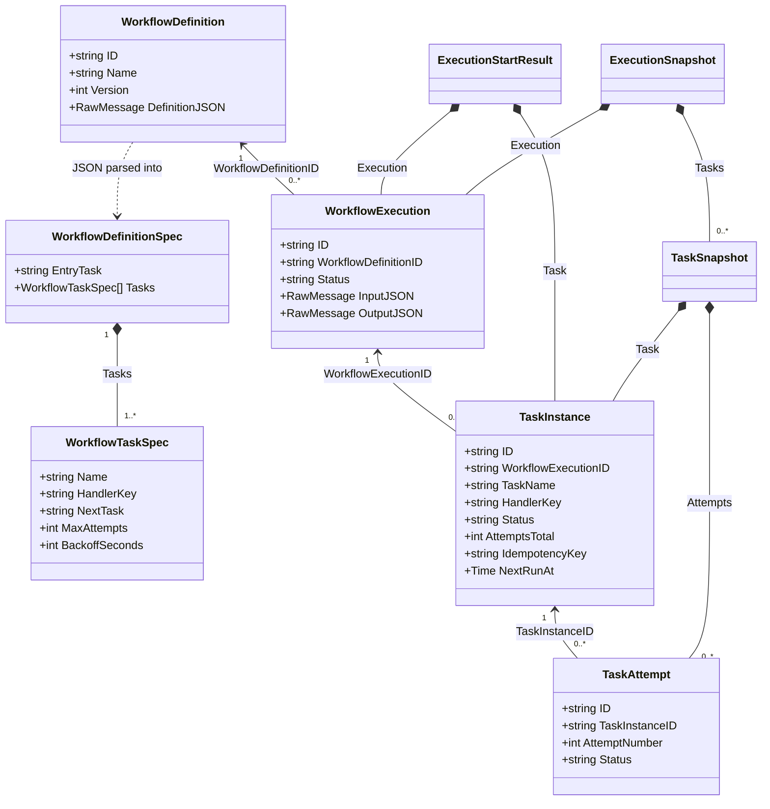

The ID arrows represent references, not in-memory parent objects. `NextRunAt` is nullable in Go. `NextTask` names another step in the same definition, and that step receives the preceding handler's output as input. The persisted task key is `executionID:taskName`; replay preserves it.

## Dispatch models

The publisher decodes an outbox payload into `domain.DispatchTaskPayload`, then copies its identifiers into `queue.TaskMessage`. The worker loads the task's input and state from Postgres.

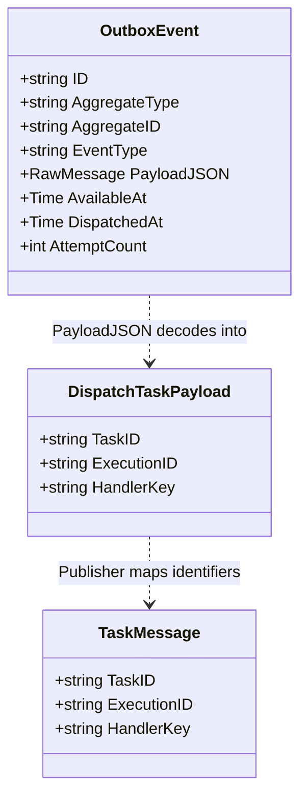

`DispatchedAt` is nullable. `AggregateID` refers to the task; Redis serializes `TaskMessage` as JSON in the stream entry's `payload` field. Source: [domain models](../internal/domain/models.go), [publisher](../internal/outbox/publisher.go), and [queue models](../internal/queue/redis_streams.go).

## Handler strategy and persistence contract

`Worker` selects a handler using the persisted task's `HandlerKey`. Both built-in implementations satisfy the same contract. `Registry` holds existing handler objects in a map; it does not construct a new handler for every delivery.

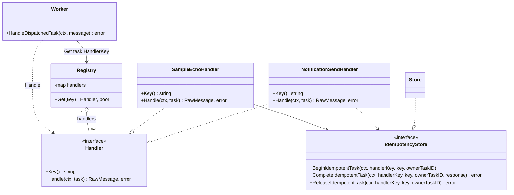

Source: [registry](../internal/handlers/registry.go), [echo handler and persistence interface](../internal/handlers/sample_handler.go), [notification handler](../internal/handlers/notification_handler.go), and [idempotency store](../internal/db/idempotency.go).

## Dependency injection

Each `main` function creates the dependencies and passes them to constructors. The API and worker are separate processes with separate store and queue objects, connected to the same infrastructure.

### API process

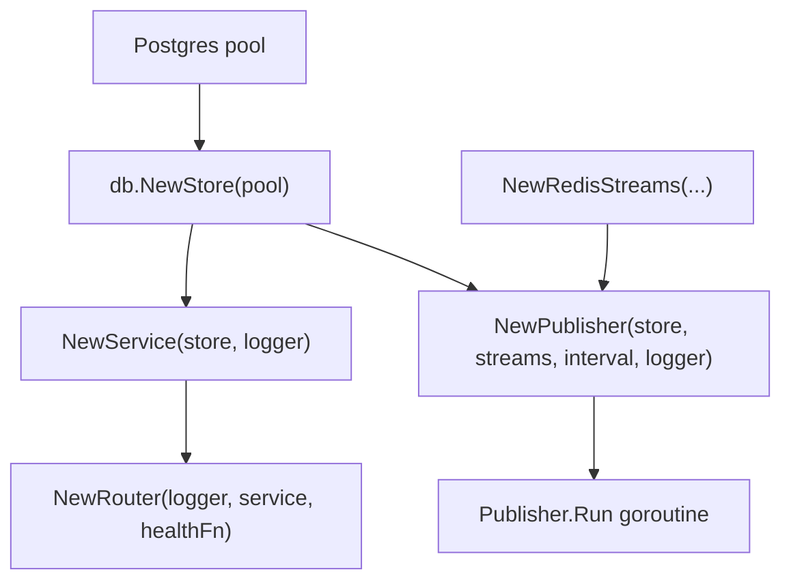

### Worker process

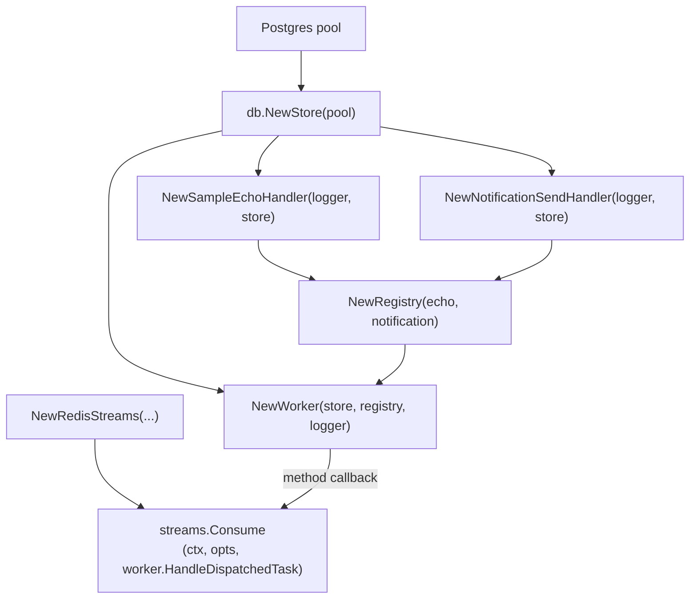

This is manual constructor injection. Worker tests substitute `workerStore`; handler tests substitute `idempotencyStore`. The service and publisher still depend on concrete store types. The consumer handles messages sequentially within one process; more worker processes provide parallel execution.

Source: [API startup](../apps/api/main.go), [worker startup](../apps/worker/main.go), [worker test doubles](../internal/orchestrator/worker_test.go), and [handler test doubles](../internal/handlers/sample_handler_test.go).

## Execution creation

Workflow creation validates and stores the JSON definition first. Triggering an execution loads that definition, resolves the entry task, and commits the initial task and dispatch intent together.

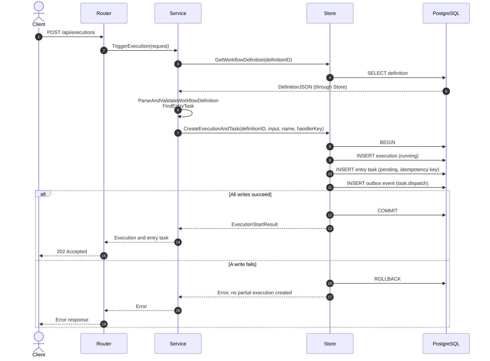

The API response confirms creation, not task completion. An API crash after commit leaves the outbox row available to the publisher. Client retries of the trigger request are not deduplicated by the task's idempotency key; they can create another execution.

Source: [router](../internal/httpapi/router.go), [service](../internal/orchestrator/service.go), and `CreateExecutionAndTask` in [store.go](../internal/db/store.go).

## Outbox dispatch

The publisher first materializes due retries, then reads up to 20 pending outbox rows. Task input remains in Postgres; Redis receives identifiers in `TaskMessage`.

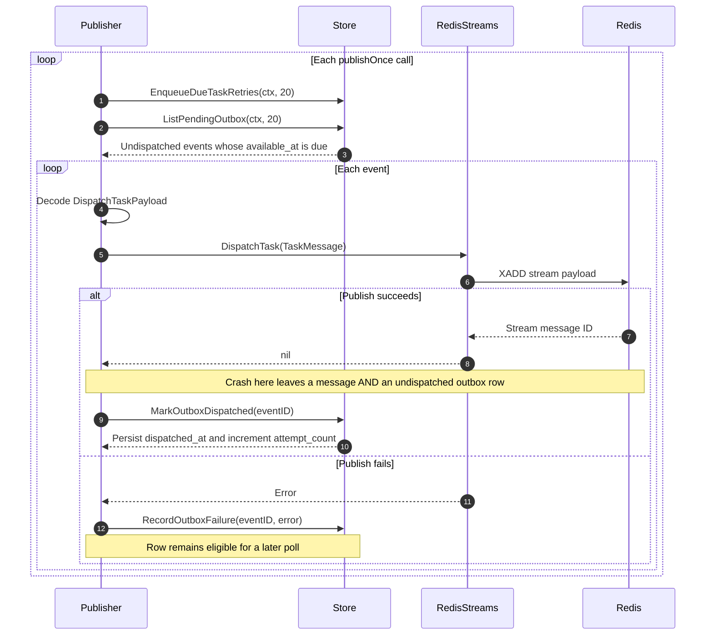

If publication succeeds but marking the row fails, a later poll can publish it again. Payload decoding failures are also recorded and leave the row pending. `ListPendingOutbox` does not claim rows exclusively, so concurrent publishers can select the same events. The `SKIP LOCKED` used for due retries does not extend to this query.

Source: [publisher.go](../internal/outbox/publisher.go), [redis_streams.go](../internal/queue/redis_streams.go), and the outbox methods in [store.go](../internal/db/store.go).

## Execution and chaining

The queue invokes the injected worker callback. The worker resolves the workflow from Postgres, starts an attempt, and selects the handler from the registry. This diagram shows successful persistence; the ACK rule below also applies to failures.

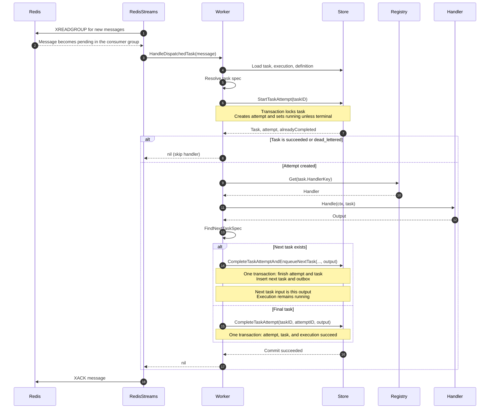

The next task is published through the ordinary outbox loop. Any failed write in the completion transaction rolls back the entire transition, including next-task creation.

| Worker callback result | Queue action |
| --- | --- |
| `nil`: completed, terminal task skipped, retry persisted, or dead-letter persisted | Attempt `XACK` |
| Error loading state or persisting an outcome | Leave message pending for reclaim |
| Payload cannot be decoded before the callback | Return an error from the consumer; worker startup cancels its context |

A successful ACK removes the pending entry, not the stream entry. ACK failure exits the consumer; later redelivery is still possible.

Source: [worker.go](../internal/orchestrator/worker.go), [store.go](../internal/db/store.go), and [queue processing](../internal/queue/redis_streams.go). The [rollback regression test](../internal/db/store_integration_test.go) checks that a next-task conflict does not partially complete the current task.

## Retries

Any handler error is retried while `attempt.AttemptNumber < MaxAttempts`. An omitted or zero `MaxAttempts` becomes one. The delay is a fixed `BackoffSeconds` per retry, with no exponential growth or jitter.

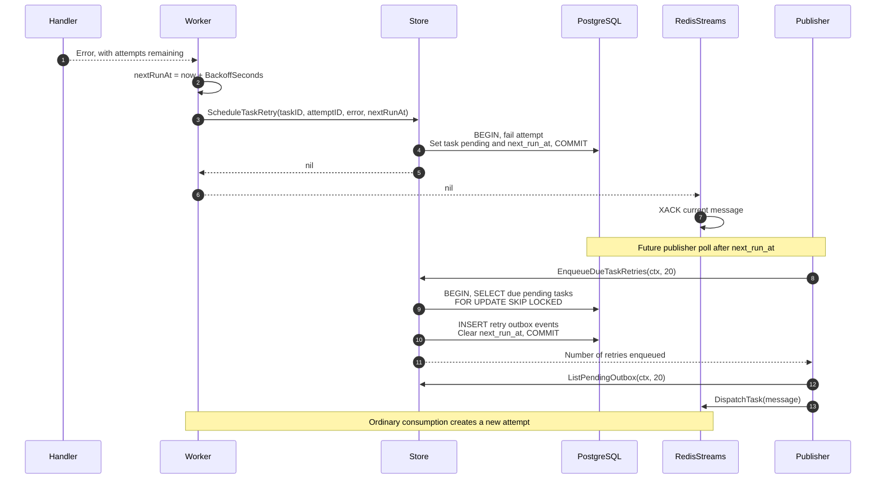

The execution stays `running` during retry waits. A scheduling or enqueue transaction failure leaves the previous durable state intact. The scheduled delay controls new retry dispatch, but `StartTaskAttempt` does not check `next_run_at`; an older duplicate delivery can start the pending task before that time.

Source: [worker retry policy](../internal/orchestrator/worker.go), [publisher scheduling](../internal/outbox/publisher.go), and [retry integration test](../internal/db/store_integration_test.go).

## Dead-letter and replay

A missing handler dead-letters immediately. A registered handler's error dead-letters when its attempts are exhausted. Dead letters are task rows in Postgres; there is no separate Redis dead-letter stream.

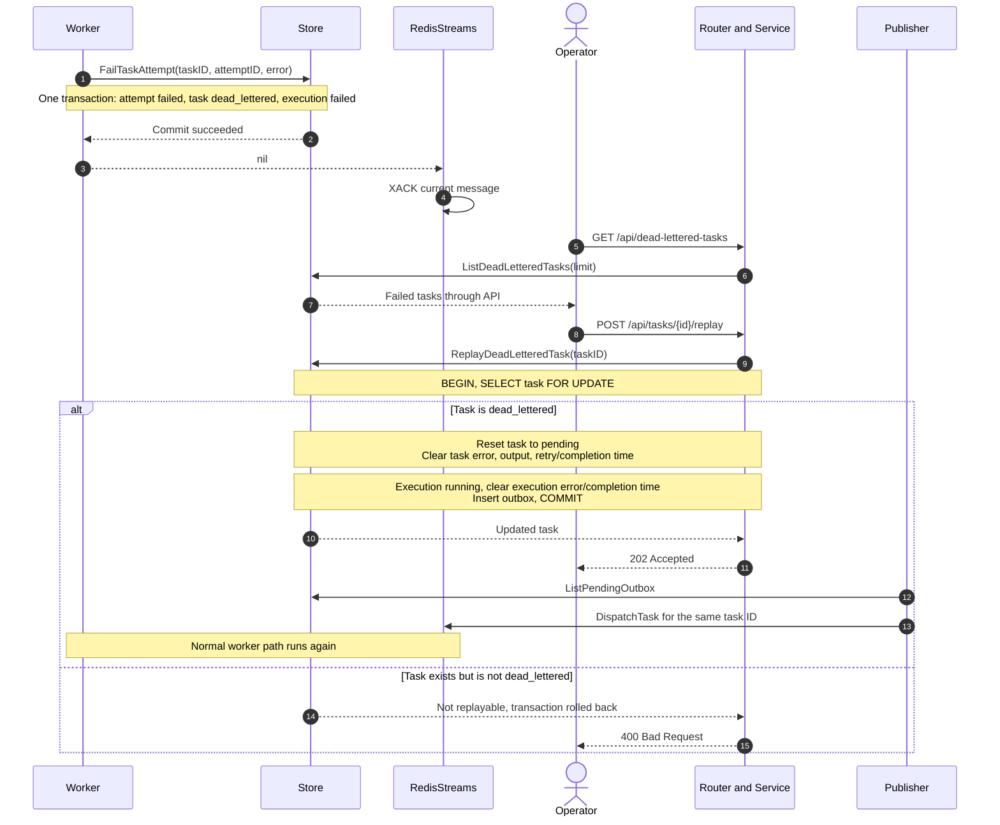

Replay retains task input, handler key, idempotency key, existing attempts, and `attempts_total`. It does not clear idempotency records or grant a fresh retry budget; the next attempt number continues from the previous total. Repeating a replay request while the task is pending is rejected. A missing task returns 404.

Source: [replay route](../internal/httpapi/router.go), [replay transaction](../internal/db/store.go), and [dead-letter/replay tests](../internal/db/store_integration_test.go).

## Idempotency

Both built-in handlers call `BeginIdempotentTask` before building their response. The unique key is `(handler_key, idempotency_key)`; ownership is the task instance ID, not the attempt or worker ID.

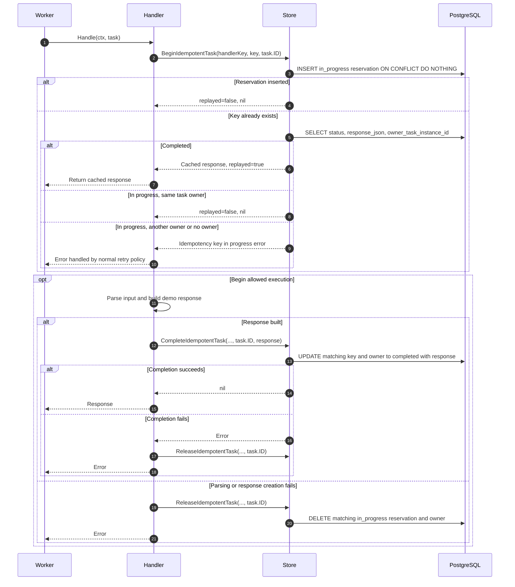

These methods use separate database statements. A stored response can survive a later task-completion failure and be reused on another attempt. Reservation release is best effort and only deletes a matching in-progress row.

The sample and notification handlers produce JSON; they do not send an external notification. A real external side effect would need provider-side idempotency or another atomic boundary. Two overlapping attempts of the same task may both pass the owner check before a response is stored, so this is not an exclusive execution lock.

Source: [idempotency store](../internal/db/idempotency.go), [handler](../internal/handlers/notification_handler.go), [ownership/cache integration test](../internal/db/store_integration_test.go), and [handler failure tests](../internal/handlers/notification_handler_test.go).

## Worker recovery

The consumer tries `XAUTOCLAIM` before reading fresh messages. When a worker disappears, another consumer can claim its pending messages after the configured idle threshold.

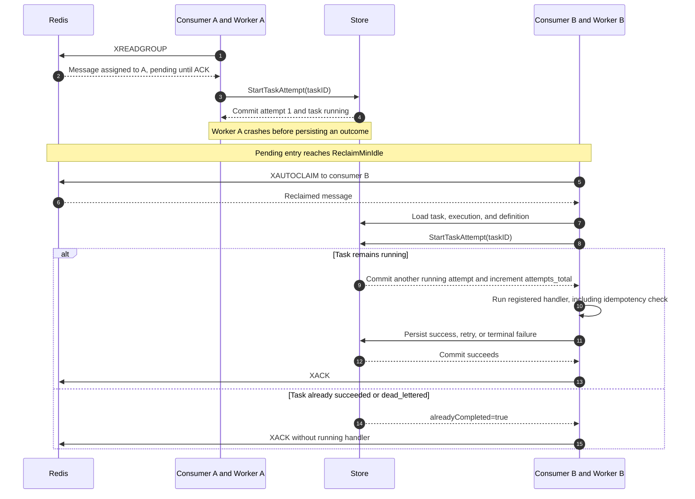

The recovery fix allows `running` tasks to start another attempt instead of being skipped and acknowledged. The earlier attempt remains `running` in history. Database errors leave the message pending.

The idle threshold is not a heartbeat or task lease: a slow live worker can also have its message reclaimed. Row locks protect individual state-change transactions, but are released before handler execution. There is no attempt fencing to prevent an older worker from writing an outcome later. The current reclaim call also restarts at `0-0` and discards the returned scan cursor.

Source: [reclaim and ACK code](../internal/queue/redis_streams.go), [attempt creation](../internal/db/store.go), [running-task regression test](../internal/db/store_integration_test.go), and [Redis reclaim test](../internal/queue/redis_streams_integration_test.go). These tests cover attempt recreation and message reclaim separately; they are not proof of exclusive execution during overlapping recovery.

## Snapshot reads

The dashboard polls the execution API every two seconds after an execution is selected. The store loads attempts for all tasks in one query and groups them by task ID.

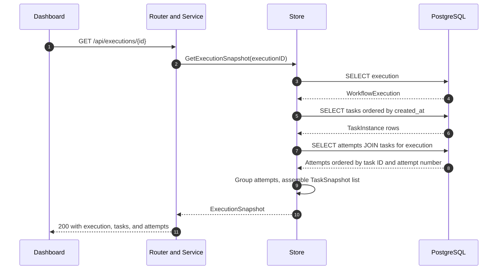

These are separate queries, not one repeatable-read transaction. Concurrent worker updates can therefore produce a response containing observations from different moments; later polls refresh it.

Source: [dashboard polling](../apps/web/src/App.tsx), [snapshot route](../internal/httpapi/router.go), and [snapshot queries](../internal/db/store.go).

## Pattern names used here

| Pattern or technique | Concrete use |
| --- | --- |
| Repository-style store | `db.Store` hides SQL and exposes transaction-level operations. Worker and handler interfaces allow test doubles. |
| Strategy | A common `Handler` interface with implementations selected by `Registry.Get`. |
| Dependency injection | Constructors receive the store, registry, logger, and queue dependencies from `main`. |
| Adapter | `RedisStreams` wraps publishing, consumer groups, decoding, reclaim, and ACKs. |
| Transactional outbox | Database changes and dispatch intent commit together; publication is retried separately. |
| Explicit state machine | Status values and store methods implement transitions; there are no separate GoF State objects. |

`next_task` is workflow sequencing, not the Chain of Responsibility pattern. The registry is a map of existing strategies, not an Abstract Factory. These distinctions keep the LLD explanation tied to the implementation.
