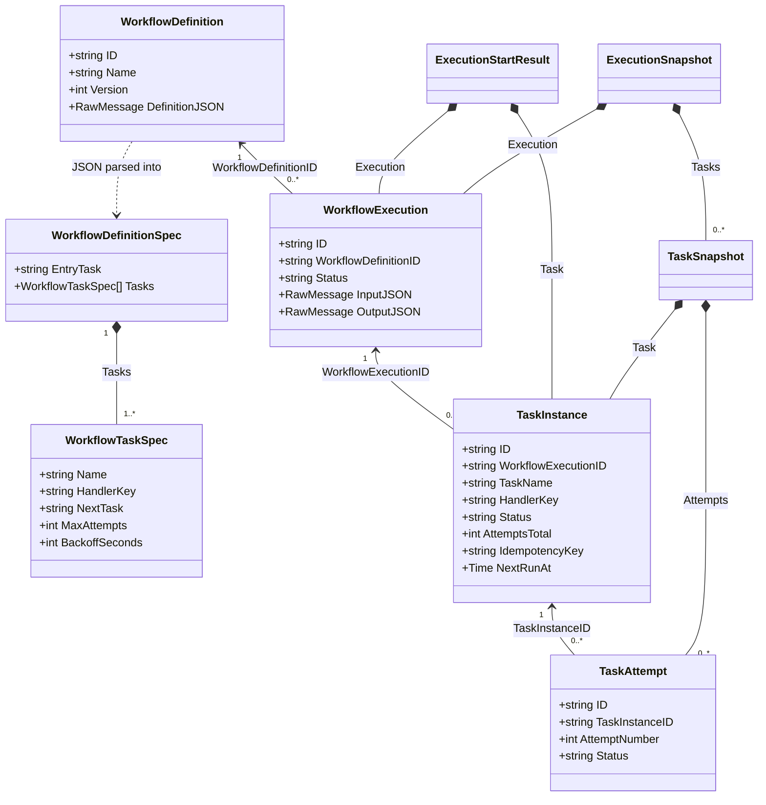
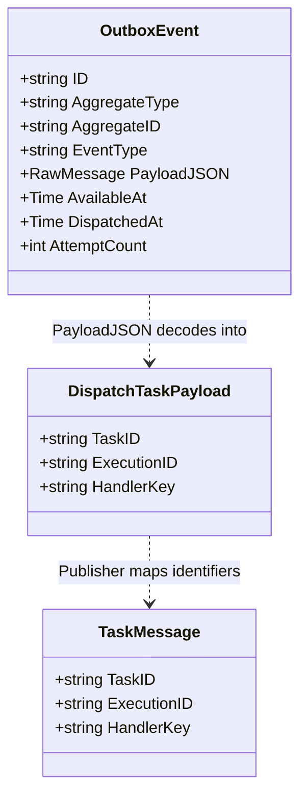
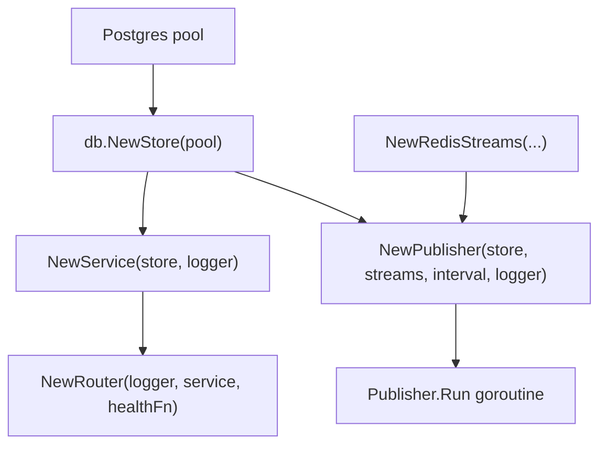

# DurableFlow Low-Level Design

The diagrams below follow the current Go code. Boxes represent structs and interfaces; sequence arrows name the methods that coordinate each feature. Transaction notes identify which writes commit together.

## Domain classes

A definition describes reusable steps. An execution is one run of that definition; a task instance is one step in that run, and attempts record individual tries. Fields below are selected from [domain/models.go](../internal/domain/models.go); timestamps and error fields are omitted for space.

The ID arrows represent references, not in-memory parent objects. `NextRunAt` is nullable in Go. `NextTask` names another step in the same definition, and that step receives the preceding handler's output as input. The persisted task key is `executionID:taskName`; replay preserves it.

## Dispatch models

The publisher decodes an outbox payload into `domain.DispatchTaskPayload`, then copies its identifiers into `queue.TaskMessage`. The worker loads the task's input and state from Postgres.

`DispatchedAt` is nullable. `AggregateID` refers to the task; Redis serializes `TaskMessage` as JSON in the stream entry's `payload` field. Source: [domain models](../internal/domain/models.go), [publisher](../internal/outbox/publisher.go), and [queue models](../internal/queue/redis_streams.go).

## Handler strategy and persistence contract

`Worker` selects a handler using the persisted task's `HandlerKey`. Both built-in implementations satisfy the same contract. `Registry` holds existing handler objects in a map; it does not construct a new handler for every delivery.

Source: [registry](../internal/handlers/registry.go), [echo handler and persistence interface](../internal/handlers/sample_handler.go), [notification handler](../internal/handlers/notification_handler.go), and [idempotency store](../internal/db/idempotency.go).

## Dependency injection

Each `main` function creates the dependencies and passes them to constructors. The API and worker are separate processes with separate store and queue objects, connected to the same infrastructure.

### API process

