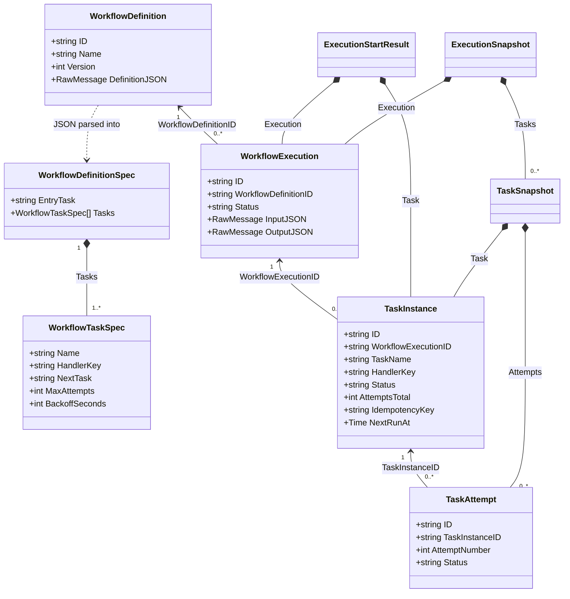

# DurableFlow Low-Level Design

The diagrams below follow the current Go code. Boxes represent structs and interfaces; sequence arrows name the methods that coordinate each feature. Transaction notes identify which writes commit together.

## Domain classes

A definition describes reusable steps. An execution is one run of that definition; a task instance is one step in that run, and attempts record individual tries. Fields below are selected from [domain/models.go](../internal/domain/models.go); timestamps and error fields are omitted for space.

The ID arrows represent references, not in-memory parent objects. `NextRunAt` is nullable in Go. `NextTask` names another step in the same definition, and that step receives the preceding handler's output as input. The persisted task key is `executionID:taskName`; replay preserves it.
